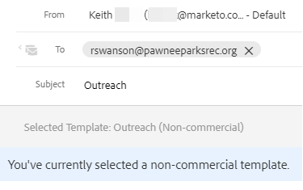

# Transactional Sales Email Templates {#transactional-sales-email-templates}

If your team is sending out transactional or non-commercial emails, you can mark an email template as non-commercial so it can bypass unsubscribes.

## Things to Note {#things-to-note}

* Non-commercial emails will bypass sales unsubscribes and [Marketo Engage unsubscribe check](/help/marketo/product-docs/marketo-sales-insight/actions/email/unsubscribes/marketo-unsubscribe-check.md){target="_blank"}, but will not bypass [blocked domains](/help/marketo/product-docs/marketo-sales-insight/actions/admin/blocked-domains.md){target="_blank"}.

* Unsubscribe messages will not be automatically appended to non-commercial emails, even if the [append unsubscribe message admin setting](/help/marketo/product-docs/marketo-sales-insight/actions/email/unsubscribes/auto-append-unsubscribe-message-setting.md){target="_blank"} is enabled. However, the `{{team_unsubscribe}}` [dynamic field](/help/marketo/product-docs/marketo-sales-insight/actions/templates/dynamic-fields.md){target="_blank"} will still populate your team unsubscribe message.

## Configure an Email Template for Non-commercial Use {#configure-an-email-template-for-non-commercial-use}

1. In the header, click **Templates**.

   

1. Find and select the template you want to update.

   

1. Enable the non-commercial email toggle under Template Settings.

   

## Send a Non-commercial Email {#send-a-non-commercial-email}

>[!NOTE]
>
>When an unsubscribed person is selected, they'll be highlighted orange.

1. In the header, click **Compose**. Find and select the desired non-commercial template.

   

1. Users will see a banner showing them they have selected a non-commercial email template.

   

1. Click **Send**.

   

The email will still be sent even if the person is unsubscribed.
