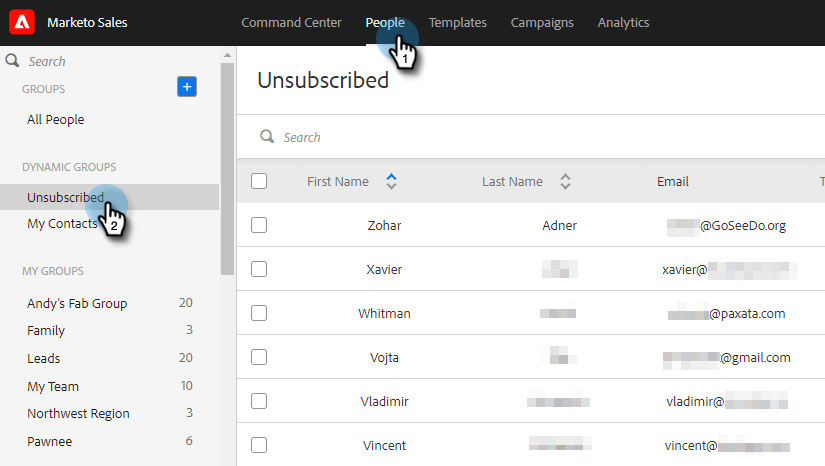
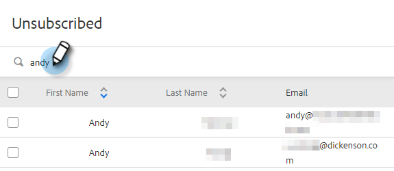
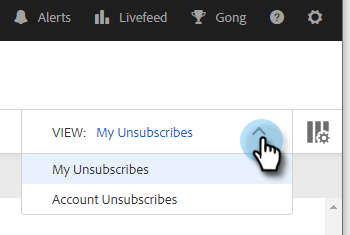
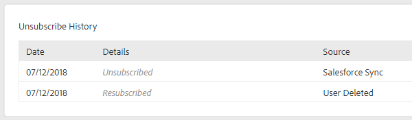

# Unsubscribe Overview {#unsubscribe-overview}

It's becoming increasingly important for organizations to be in compliance with email privacy laws. To help with this, we've made some enhancements to our unsubscribe experience.

* Unsubscribe links are placed on all emails sent from [!DNL Marketo Sales] and [!DNL Salesforce] (this does not apply to custom emails sent from [!DNL Outlook] or Gmail)
* Admins can edit unsubscribe messaging for their entire team
* Unsubscribe information is stored in PDV
* Unsubscribes can be done manually: Clicked Link, [!DNL Salesforce] Sync, and Bounce
* New unsubscribe link landing page

## Unsubscribe Link Landing Page {#unsubscribe-link-landing-page}

When a person clicks your unsubscribe link, they'll be taken to an unsubscribe landing page where they can select what they would like to be unsubscribed from and why.

This information will get saved to the person details view for viewing later.

## Unsubscribe Group {#unsubscribe-group}

See and manage all of your unsubscribed people in one place.

Use the search bar to look up any unsubscribed people.

If you're an Admin, you can go to the unsubscribe group to filter by [!UICONTROL Account Unsubscribes] and see all of the unsubscribes that have been collected in your people database.

## Unsubscribe History Card {#unsubscribe-history-card}

The [!UICONTROL Unsubscribe History] Card helps admins and users get contextual information about their contacts' unsubscribe history. Navigate there by going to the [!UICONTROL People] tab and selecting a person. It's at the bottom of the [!UICONTROL About] tab in the Person Details View.

>[!NOTE]
>
>There will only be an [!UICONTROL Unsubscribe History] card if the person has _resubscribed_ at some point.

<table> 
 <colgroup> 
  <col> 
  <col> 
 </colgroup> 
 <tbody> 
  <tr> 
   <td><strong>[!UICONTROL Date]</strong></td> 
   <td>
Shows the date the unsubscribe/resubscribe took place.
</td> 
  </tr> 
  <tr> 
   <td><strong>[!UICONTROL Details]</strong></td> 
   <td>
Resubscribe: A [!DNL Sales Connect] admin manually removed the unsubscribe from the contact record. It may also show some details related to why the contact was unsubscribed.

Unsubscribe: The contact was unsubscribed.
</td> 
  </tr> 
  <tr> 
   <td><strong>[!UICONTROL Source]</strong></td> 
   <td>
[!DNL Salesforce] Sync: Unsubscribe was captured by a sync from [!DNL Salesforce].

Manual: User clicked the unsubscribe button to opt out.

Clicked Link: Recipient of an email clicked the unsubscribe link.

“Admin Name”: An admin's name will show when the action was to resubscribe contacts. This lets users know who removed the unsubscribe.
</td> 
  </tr> 
 </tbody> 
</table>

>[!MORELIKETHIS]
>
>[Customize Unsubscribe Link Message](/help/marketo/product-docs/marketo-sales-insight/actions/email/unsubscribes/customize-unsubscribe-link-message.md)
