# Add an Attachment or Trackable Content to Your Email {#add-an-attachment-or-trackable-content-to-your-email}

When sending an email through Marketo Sales, you have the option of adding a file as an attachment, or making a file a downloadable (and trackable) link.

>[!NOTE]
>
>Typically, any file over 20MB will be too large to be delivered. The size of an attachment you can send via email varies depending on the email delivery channel you’re using.

## Add an Attachment {#add-an-attachment}

1. Create your email draft (there are multiple ways to do this, in this example we're choosing **Compose** in the header).

   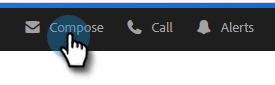

1. Populate the To field and enter a Subject.

   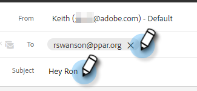

1. Click the attachment icon.

   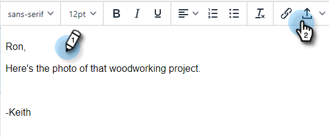

1. Select the file you want to attach and click **Insert**.

   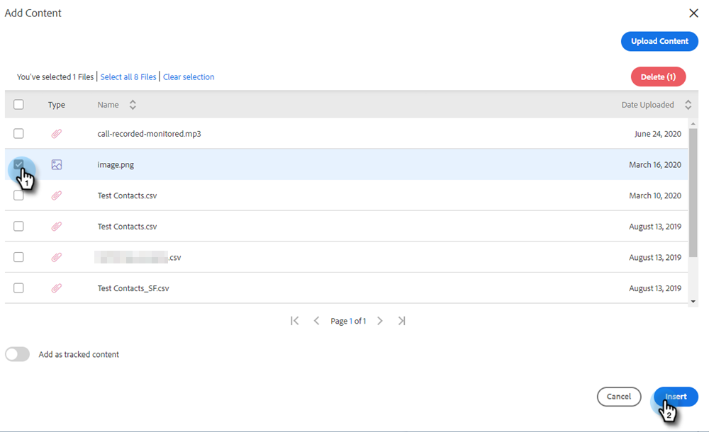

   >[!NOTE]
   >
   >If you need to upload a file, click the **Upload Content** button in the upper-right of the window.

   The attachment appears at the bottom of your email.

   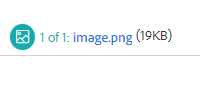

## Add Trackable Content {#add-trackable-content}

1. Create your email draft (there are multiple ways to do this, in this example we're choosing the Compose window).

   

1. Populate the To field and enter a Subject.

   

1. Click the spot in the email you want the trackable content to appear and click the attachment icon.

   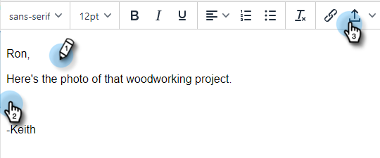

1. Select the content you want added, click the **Content is Tracked** slider, and click **Insert**.

   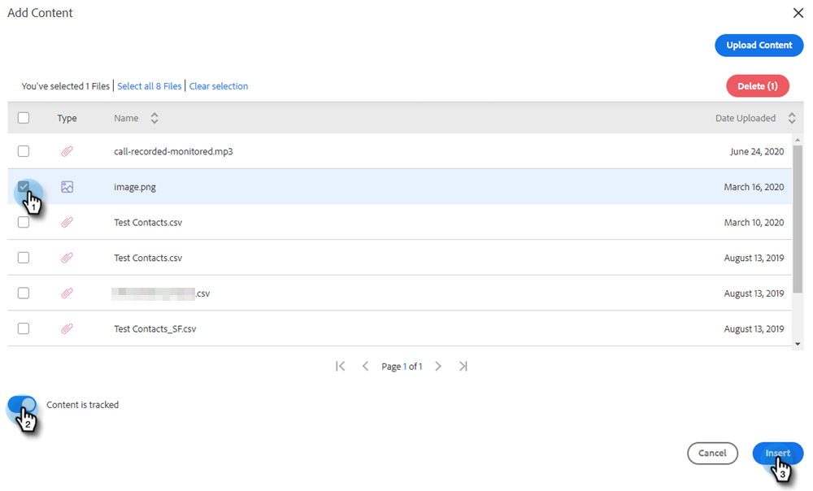

   >[!NOTE]
   >
   >If you need to upload a file, click the **Upload Content** button in the upper-right of the window.

   The content appears as a link in your email. The recipient can click the link to download the content.

   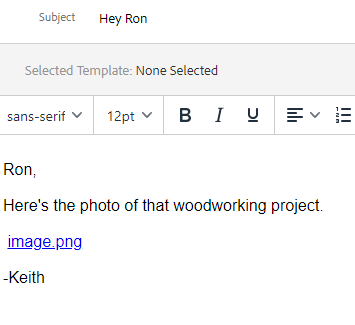

   >[!NOTE]
   >
   >Users will be notified in the Live Feed when people are viewing their tracked content. Users can also see the highest performing content in the content section of the Analytics page.

## Trackable Content Updates {#trackable-content-updates}

**Trackable Content Viewer**

When a lead clicks on trackable content in your email it will open up a content viewer.

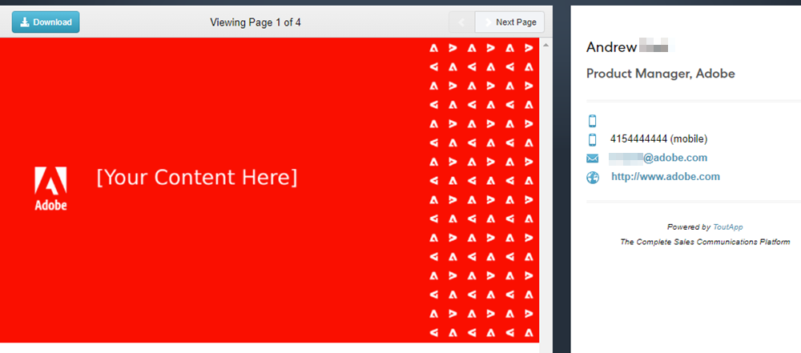

Within the content viewer leads can do the following things.

* Download the document

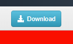

* Page through the document

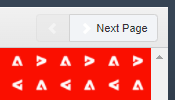

* View the sender's contact information

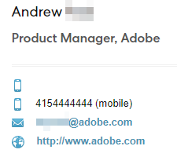

**Trackable Content Events in Live Feed**

When a lead clicks on the link of our doc you will see a click event. You can click on that link to view the content. As long as you're logged in to your Actions account in the browser, we will not count these clicks as events.

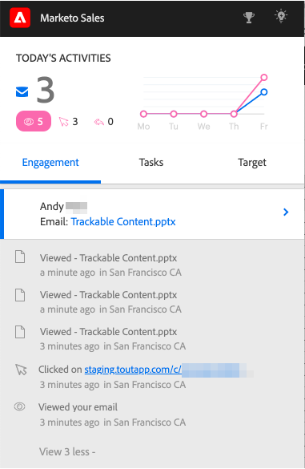

Each time the lead advances to another page on the doc you'll receive a Viewed event in the Live Feed that shows the name of the document.
