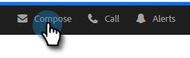
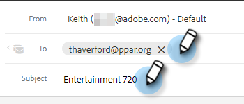
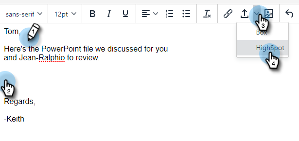

# Adding Highspot Content to Your Email {#adding-highspot-content-to-your-email}

If you're a Highspot customer, you can easily insert Highspot content into your Markto Sales emails.

1. Create your email draft (there are multiple ways to do this, in this example we're selecting **Compose** in the header).

   

1. Populate the To field and enter a Subject.

   

1. Write your message. Click the spot in the email where you want the Highspot content inserted. Click the arrow drop-down (next to the image icon) and select **Highspot**.

   

1. Log in to your Highspot account.

   

1. Select your desired content and click the **Add Content** button.

   

   >[!TIP]
   >
   >If you don't quickly see the content you want, use the search bar at the top.

   The content appears as a link in your email. The recipient can click the link to view/download it.

   
