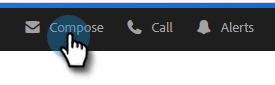
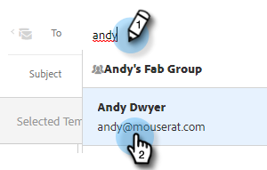
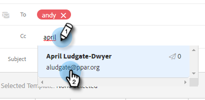
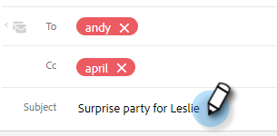
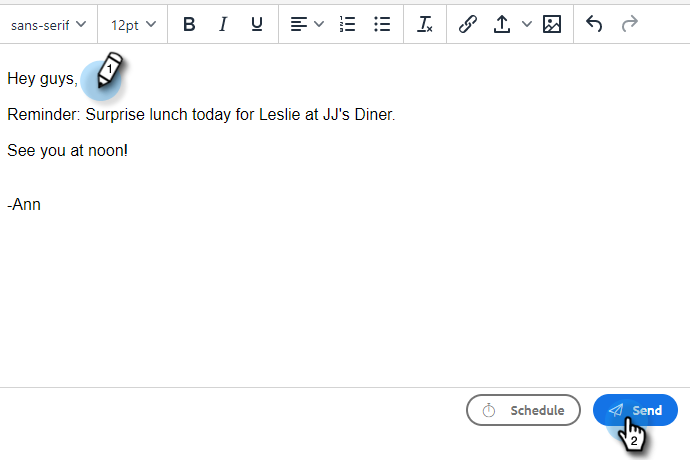

# Sending a Tracked Email {#sending-a-tracked-email}

When sending an email with Marketo Sales Connect, views (email opens) and clicks (clicked links) will be tracked.

>[!PREREQUISITES]
>
>You'll need to have an identity verified and an email delivery channel set up before sending a tracked email.
>
>* [Verify your email address](/help/marketo/product-docs/marketo-sales-insight/actions/getting-started/email-settings/verify-your-email.md)
>* Set up a Delivery Channel for [Outlook](/help/marketo/product-docs/marketo-sales-connect/email-plugins/msc-for-outlook/email-connection-for-outlook-users.md) or [Gmail](/help/marketo/product-docs/marketo-sales-connect/email-plugins/gmail/email-connection-for-gmail-users.md)

1. Create your email draft (there are multiple ways to do this, in this example we're choosing **Compose** in the header).

   

1. Enter the name or email of a recipient in the **To** field.

   

   >[!NOTE]
   >
   >You can only have one person in the To field.

1. Add any recipients you'd like to CC or BCC in the respective fields.

   

   >[!NOTE]
   >
   >If someone who's been CC’d or BCC’d opens the email, that open will be recorded as a view on the record of the person in the **To** field.

1. Add a subject line.

   

   >[!NOTE]
   >
   >A subject line and recipient is required to send the email. We will **automatically save your draft** once a subject line and recipient have been added.

1. Compose your email using the editor. Click **Send** (or [Schedule](/help/marketo/product-docs/marketo-sales-connect/email/using-the-compose-window/scheduling-an-email.md), if you prefer) when done.

   

   >[!MORELIKETHIS]
   >
   >* [Scheduling an Email](/help/marketo/product-docs/marketo-sales-insight/actions/email/using-the-compose-window/scheduling-an-email.md)
   >* [Templates](/help/marketo/product-docs/marketo-sales-insight/actions/templates/manage-templates.md#create-a-new-template)
