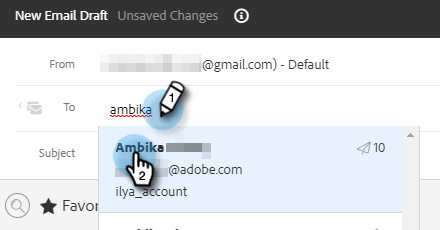
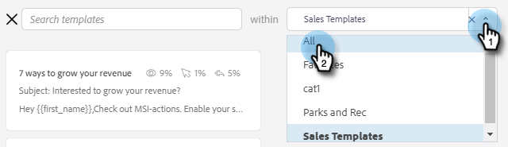
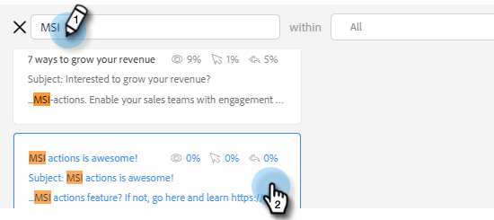

# Using a Template in the Compose Window {#using-a-template-in-the-compose-window}

## Finding and Using Templates {#finding-and-using-templates}

1. Create your email draft (there are multiple ways to do this, in this example we're choosing **[!UICONTROL Compose]** in the header).

   

1. Populate the [!UICONTROL To] field.

   

1. Click the search icon in the template section to open up the template search field.

   

1. Select a category to search in (or select [!UICONTROL All] to search across all categories).

   

1. Search by template name, subject line, or body of the email. Click on the desired template to select it.

   

   >[!NOTE]
   >
   >Selecting another template will replace all of the information currently in the editor. If you make any changes, be sure to copy them before you select another template.

## Pinning Template Categories in the Compose Window {#pinning-template-categories-in-the-compose-window}

Favorite **up to five** specific template categories to gain quick access to your most used templates.

1. Create your email draft (there are multiple ways to do this, in this example we're choosing **[!UICONTROL Compose]** in the header).

   

1. Click the **+** icon next to [!UICONTROL Favorites].

   

1. Click the **[!UICONTROL Pin a Category]** drop-down and select your desired category.

   

   >[!TIP]
   >
   >We recommend pinning the "All" category to give you quick access to searching your entire template library, since you may often need to search through all your Templates to find what you are looking for. When you have a pinned category selected and click the search icon, the search will default to the search within the pinned category selected.

1. Click **Save Changes** when done (optional: repeat Step 3 to add more).

   

   >[!TIP]
   >
   >You can rearrange your pinned categories simply by dragging and dropping before saving your changes.

   

   >[!NOTE]
   >
   >**[!UICONTROL Favorites]** is there by default. It holds favorite email templates, not categories.

   Your selected category is now pinned.
