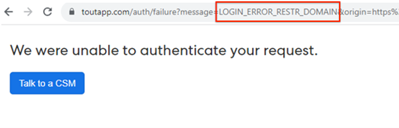
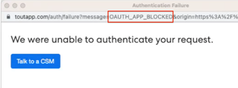

# How Do I Fix "We Were Unable to Authenticate Your Request" When Connecting to Salesforce {#how-do-i-fix-we-were-unable-to-authenticate-your-request-when-connecting-to-salesforce}

If you're trying to connect your Marketo Sales instance to Salesforce and you're seeing the "We are unable to authenticate your request" error, it's likely related to how your Salesforce instance is configured.

There are two types of errors that could be producing this failed authentication page.

* Login error restricted Domain
* Oauth App Blocked

You can identify which type you're getting by checking the URL.

## Resolve Login Error Restricted Domain {#resolve-login-error-restricted-domain}

This error typically indicates you have a custom domain that we're not able to route to. To resolve this error, try signing in to the Salesforce instance you want to connect to first. Then, go through the steps to connect to Salesforce.

If the instance you're trying to connect to is a Salesforce Sandbox domain and you're getting an error, you'll need to go through additional steps to update your instance to be Salesforce Sandbox compatible. [Learn more](/help/marketo/product-docs/marketo-sales-insight/actions/crm/salesforce-integration/set-up-a-sales-insight-actions-sandbox.md){target="_blank"}. 

## Resolve Oauth App Blocked {#resolve-oauth-app-blocked}

If you receive the error message "We were unable to authenticate your request" with the Oauth App Blocked error type or another type in the URL, there might be a restriction on your access to Salesforce's API. Check with your Salesforce Admin to make sure the following things are in place. 

### Enable API in User Permissions {#enable-api-in-user-permissions}

1. Have a Salesforce Admin log in to Salesforce.
1. Select **Setup**.
1. Select **Manage Users**.
1. Select **Profiles**.
1. Find the Profile that the ToutApp users are under and click **Edit**.
1. Scroll down to **Administrative Permissions** and make sure **API Enabled** is checked.

### Check if Salesforce is Blocking Sales Insight Actions from Connecting {#check-if-salesforce-is-blocking-sales-insight-actions-from-connecting}

1. Have a Salesforce Admin log in to Salesforce.
1. Select **Setup**.
1. Select **Manage Apps**.
1. Select **Connected Apps OAuth Usage**.
1. Make sure that Sales Insight Actions shows "Block" next to it. If you see "Unblock," click the button to unblock Sales Insight Actions' access to Salesforce.
