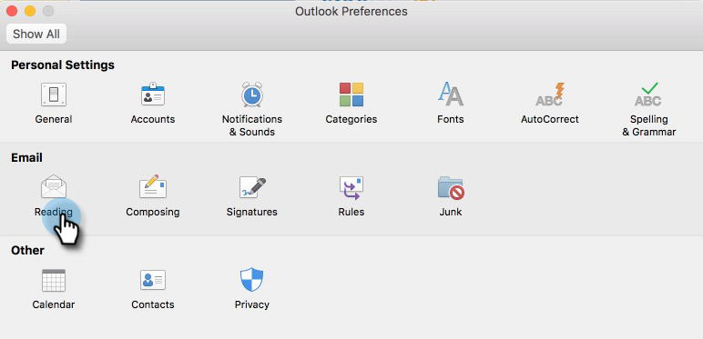

# How Do I Prevent Self Views? {#how-do-i-prevent-self-views}

Getting false positives on your view tracking can lead to reporting inconsistencies. This often occurs when users of [!DNL Marketo Sales] accidentally invoke the tracking pixel from their email client (we call this a self-view). Below are a few tips on significantly reducing and even eliminating self-views.

## Web ([!DNL Outlook] Web App and Gmail) {#web-outlook-web-app-and-gmail}

[!DNL Marketo Sales] will store a cookie in your browser to prevent views from being tracked when opening your emails from [!DNL Outlook] Web App and Gmail. If you are still receiving self-views, we recommend doing the following:

* Ensure that you have cookies enabled on your computer.

* If you're using a new computer or mobile device, make sure you've logged in to the web application. This will allow us to recognize your computer/device going forward.

## Desktop (Windows) {#desktop-windows}

Views are tracked by downloading a small invisible image pixel in your email client. You can significantly lower the amount of self-views in [!DNL Outlook] by disabling images to be automatically downloaded. Below are the steps how.

1. In Outlook, click **[!UICONTROL File]** in the menu bar.

   

1. Click **[!UICONTROL Options]**.

   

1. In the [!DNL Outlook] Options dialog box, click **[!UICONTROL Trust Center]**.

   

1. Under Microsoft [!DNL Outlook] Trust Center, click **[!UICONTROL Trust Center Settings]**.

   

1. Click [!UICONTROL Automatic Download] in the menu on the left, and select the **[!UICONTROL Don't download pictures automatically in HTML email or RSS items]** check box.

   

1. Click **[!UICONTROL OK]** in the [!UICONTROL Trust Center] dialog box.

   

1. Click **[!UICONTROL OK]** in the [!DNL Outlook] Options dialog box.

   

## Desktop (Mac) {#desktop-mac}

Views are tracked by downloading a small invisible image pixel in your email client. You can significantly lower the amount of self-views in [!DNL Outlook] by disabling images to be automatically downloaded. Below are the steps how.

1. In [!DNL Outlook], click **[!UICONTROL Outlook]** in the menu bar and select **[!UICONTROL Preferences]**.

   

1. Under [!UICONTROL Email], choose **[!UICONTROL Reading]**.

   

1. Under [!UICONTROL Security], click the **[!UICONTROL Never]** radio button.

   
