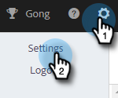
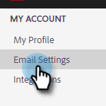
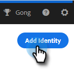
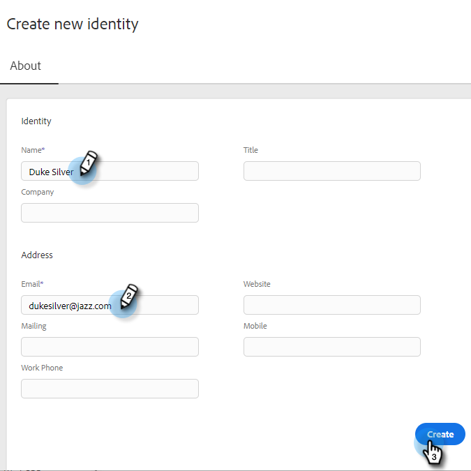
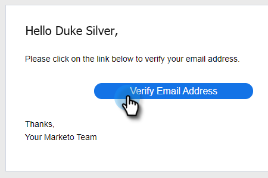

# Add Identity {#add-identity}

Add an identity when you have multiple email addresses to send from.

>[!NOTE]
>
>Using multiple identities is not supported with Gmail or Outlook/Exchange delivery channels. Gmail and Outlook/Exchange authenticate on a user level, so only emails from the email address connected will send. To use multiple identities with different email addresses, you'll need to connect a third-party SMTP provider (email delivery channel) that allows you to register email domains to send from. This allows users to connect to the SMTP delivery channel and send from any email address as long as they are a registered domain.

1. Click the Settings icon.

   

1. Click **Email Settings**.

   

1. Click **Add Identity**.

   

1. Enter the information (email and name are required fields) and click **Create**.

   

1. You will then receive a "Please Verify Email Address" email. To verify, click **Verify Email Address**.

   

When you send an email in Marketo Sales and have multiple identities, you can toggle between them.

>[!NOTE]
>
>There is no limit to the amount of email identities you can set up.

>[!MORELIKETHIS]
>
>[Add or Update Your Email Signature](/help/marketo/product-docs/marketo-sales-insight/actions/getting-started/email-settings/add-or-update-your-email-signature.md).
