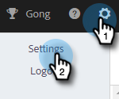
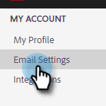
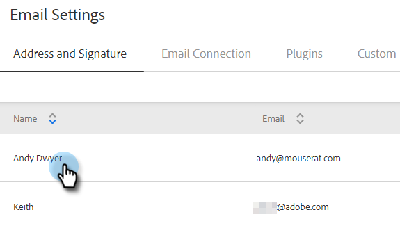
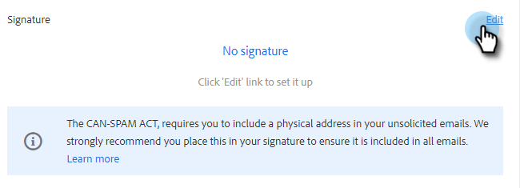

# Add or Update Your Email Signature {#add-or-update-your-email-signature}

We want emailing from Marketo Sales to feel like a seamless experience when sending from your own email client. A great way to do this is to add your email signature.

1. Click the gear icon and select **[!UICONTROL Settings]**.

   

1. Under [!UICONTROL My Account], select **[!UICONTROL Email Settings]**.

   

1. In the **[!UICONTROL Address and Signature]** tab, select the email identity you want to create a signature for.

   

1. In the [!UICONTROL Signature] card, click **[!UICONTROL Edit]**.

   

1. Enter your desired text (or images) and click **[!UICONTROL Save]**.

   

   >[!TIP]
   >
   >Make sure your signature in the compose screen looks similar to the signature listed in your email client.
