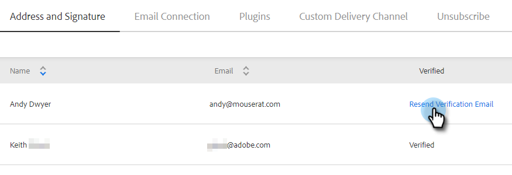
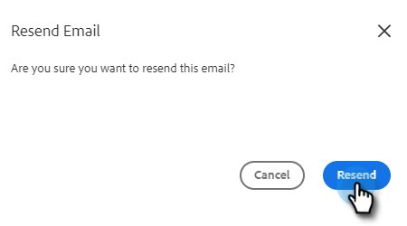
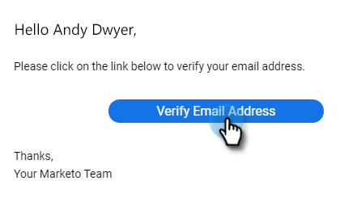

# Verify Your Email {#verify-your-email}

If you have an email identity that isn't verified, follow the steps below.

1. Click the gear icon on the top right and choose **Settings**.

   

1. Under My Account, click **Email Settings**.

   

1. Under Address and Signature, find the email you’d like to verify and click **Resend Verification Email**. A new verification email will be sent.

    

1. Click **Resend**.

   

1. The recipient then opens the email and follows the steps to verify the email address.

   

>[!NOTE]
>
>If you don't receive the verification email, check your spam folder. If it's not there, please contact [Marketo Support](https://nation.marketo.com/t5/Support/ct-p/Support).
