# Sales Insight Actions Admin Setup Guide {#sales-insight-actions-admin-setup-guide}

>[!NOTE]
>
>Marketo Sales Insight Actions is a web-based application that integrates with the Salesforce user interface via the [Marketo Sales Insight package](/help/marketo/product-docs/marketo-sales-insight/msi-for-salesforce/installation/install-marketo-sales-insight-package-in-salesforce-appexchange.md){target="_blank"}. It is sometimes referred to as "Marketo Sales," or simply "Actions."

>[!PREREQUISITES]
>
>* Confirm with the Adobe Account Team (your Account Manager) that MSI Actions has been enabled for your Marketo Engage Account (if you don't have an Account Manager, contact [Marketo Support](https://nation.marketo.com/t5/support/ct-p/Support){target="_blank"}).
>* Your Marketo/Salesforce sync must be set up.

<table>
 <tr>
  <th>Persona</th>
  <th>Step</th>
 </tr>
 <tr>
  <td>Marketo Admin</td>
  <td>Set up Marketo Sales account</td>
 </tr>
 <tr>
  <td>Marketo Admin or  Salesforce Admin</td>
  <td>Connect Marketo Sales account to Salesforce</td>
 </tr>
 <tr>
  <td>Marketo Admin</td>
  <td>Connect Marketo Sales account to Marketo</td>
 </tr>
 <tr>
  <td>Marketo Admin</td>
  <td>Initiate Data Sync from Marketo to Marketo Sales Account</td>
 </tr>
 <tr>
  <td>Marketo Admin</td>
  <td>Invite users to MSI-Actions</td>
 </tr>
 <tr>
  <td>Salesforce Admin</td>
  <td>Install/Upgrade MSI Package in Salesforce</td>
 </tr>
 <tr>
  <td>Salesforce Admin</td>
  <td>Configure MSI-Actions in Salesforce</td>
 </tr>
</table>

## Set up Marketo Sales Account {#set-up-marketo-sales-account}

1. In Marketo, click **Admin**.

   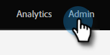

   >[!NOTE]
   >
   >If you're not seeing a Client ID and Client Secret on the Integration Information card, activate your Actions instance by inviting the first user, and you'll see the Client ID and Client Secret appear.

1. Click **Sales Insight**, then **Actions Config**. Select from a list of Marketo admins to invite and click **Send Invite**.

   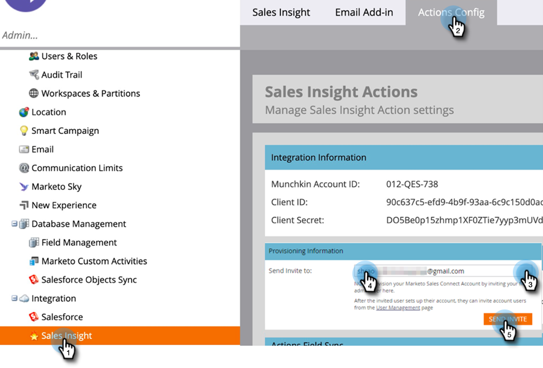

The user will receive an email with steps to get access to the account.

>[!NOTE]
>
>Additional users will not be added through Marketo and will instead be added through the Sales Account User Management page. [Click here](/help/marketo/product-docs/marketo-sales-connect/admin/invite-users.md){target="_blank"} to learn more about adding additional users.

## Connect Marketo Sales Account to Salesforce {#connect-marketo-sales-account-to-salesforce}

1. In your Marketo Sales account, click the gear icon and select **Settings**.

   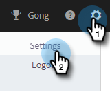

1. Under Admin Settings, click **Salesforce**.

   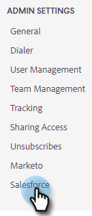

1. In the Connections & Customizations tab, click **Connect**.

   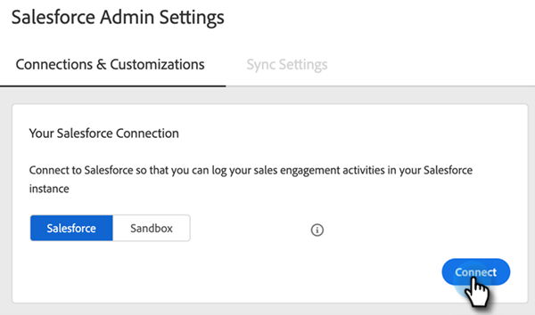

1. Click **OK**.

   

If you're already logged in to Salesforce, you'll be connected. If you're not, you'll be asked to log in.

## Connect Marketo to Your Sales Apps Account {#connect-marketo-to-your-sales-apps-account}

1. In your Marketo Sales account, click the gear icon and select **Settings**.

   

1. Under Admin Settings, click **Marketo**.

   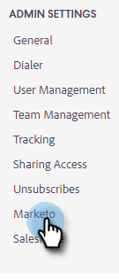

1. Click **connect**. Your account will then be connected.

   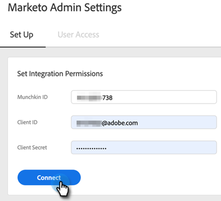

>[!NOTE]
>
>If it doesn't connect, copy the credentials from Marketo Sales Insight "Actions Config" tab and paste them in the Set Up tab.

## Initiate Data Sync {#initiate-data-sync}

The data unification field sync for Sales Insight Actions enables the system to pull person information from your Marketo Engage database into your Sales Insight Actions database, keeping your people data up-to-date and ensuring activities are logged to the right records across Marketo and Salesforce.

>[!CAUTION]
>
>Once you initiate data sync, you should **not** remove the original user on your Sales Insight Actions instance. This is the user that the first invite was sent to.

1. In Marketo, click **Admin**.

   

1. Click **Sales Insight**.

   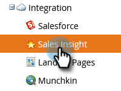

1. Click the **Actions Config** tab. In the Action Field Sync card, click **Sync**.

   

1. You'll see a preview of the fields that will be synced. Click **Start Sync**.

   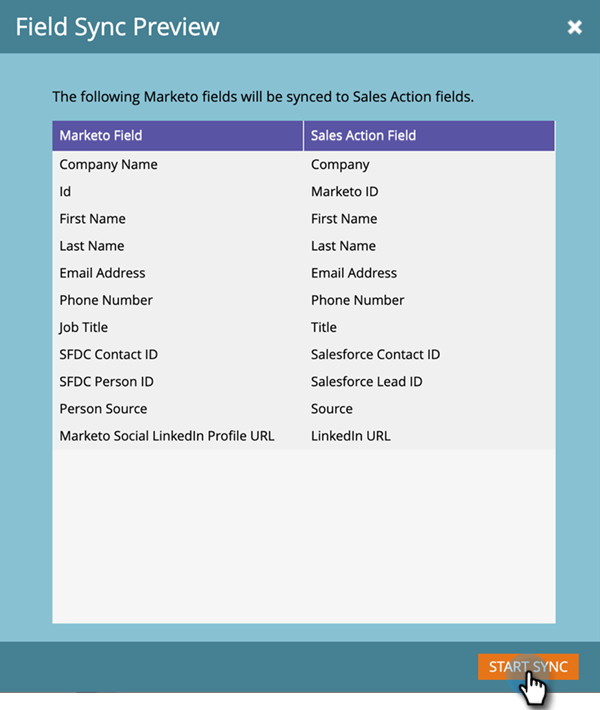

Person records that exist in Marketo and Salesforce will be synced to your Marketo Sales Apps account.

   >[!NOTE]
   >
   >To learn more about how people and activity data syncs between Sales Insight Actions, Marketo, and Salesforce, [click here](/help/marketo/product-docs/marketo-sales-insight/actions/admin/sync-sales-action-data-with-marketo-and-salesforce.md){target="_blank"}.

## Invite Individual Users to MSI Actions {#invite-individual-users-to-msi-actions}

1. In your Marketo Sales account, click the gear icon and select **Settings**.

   

1. Under Admin Settings, select **User Management**.

   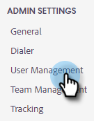

1. Click **Actions** and select **Invite Users**.

   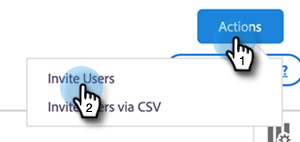

1. Enter the email address(es) and click **Invite**.

   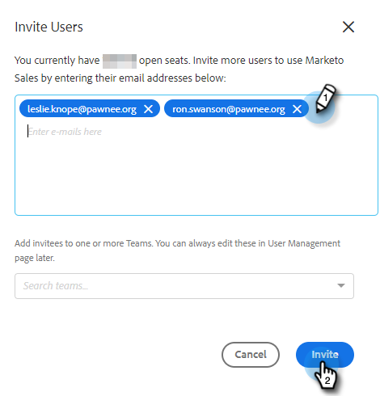

>[!NOTE]
>
>By default, all new members will be added to the Everyone team.

You'll receive a confirmation message.

## Invite Users via CSV to MSI Actions {#invite-users-via-csv-to-msi-actions}

1. In your Marketo Sales account, click the gear icon and select **Settings**.

   

1. Under Admin Settings, select **User Management**.

   

1. Click **Actions** and select **Invite Users via CSV**.

   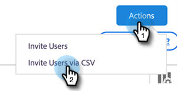

1. Browse for the CSV on your computer, select it, and click **Next**.

   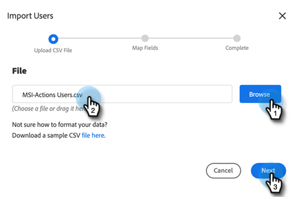

1. Confirm that the fields are mapped properly and click **Invite**.

   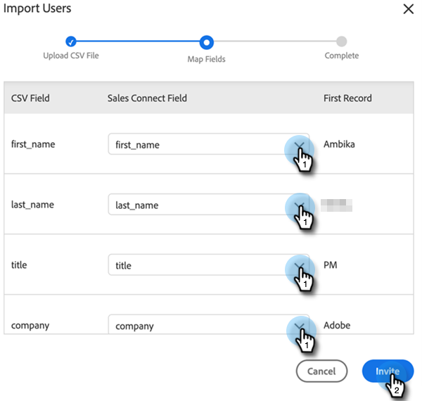

You'll receive a confirmation message once the invites are sent.

>[!NOTE]
>
>Once this is done, you can either upgrade your existing MSI package or install a new one and move on to [configuring MSI Actions in Salesforce](/help/marketo/product-docs/marketo-sales-insight/actions/crm/salesforce-package-configuration/sales-insight-actions-configuration-in-salesforce.md){target="_blank"}.
