# Sales Insight Actions User Onboarding Guide {#sales-insight-actions-user-onboarding-guide}

>[!PREREQUISITES]
>
>* An Admin needs to invite a user to start using MSI-Actions.  
>* In order to activate your account with Salesforce, you'll need to have "API Enabled" in the Salesforce profile permissions.

New users will need to follow the steps below.

1. In the welcome email, click **Get Started**.

   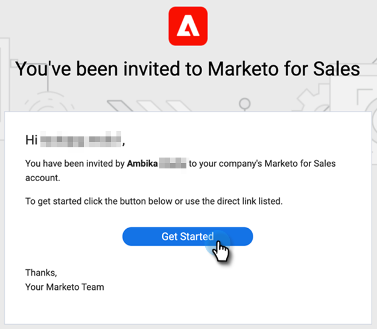

1. Click **Activate Account with Salesforce**.

   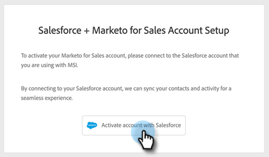

1. If you're already logged in to your Salesforce account, you'll automatically be directed to the next screen. If you're not logged in, do so now.

   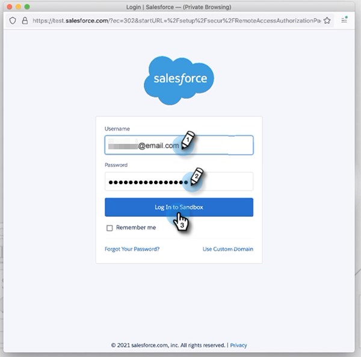

>[!NOTE]
>
>Your salesforce email id and sales account email id must be the same.

1. Click **Allow**.

   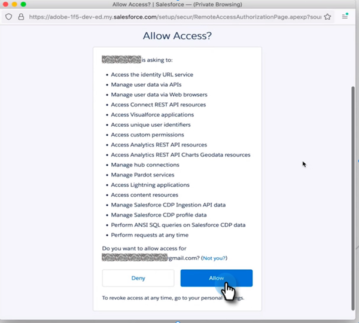

1. Click **Start**.

   

1. Click **Next**.

   

1. Choose the email client you use (Gmail or Outlook) and click **Next**.

   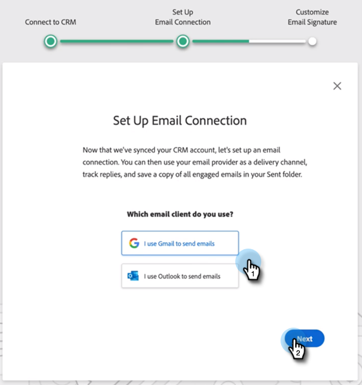

1. Enter your email address and click **Next**.

   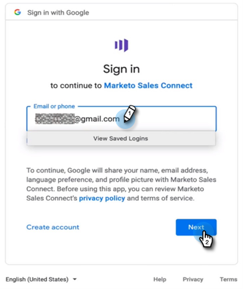

1. Enter your password and click **Next**.

   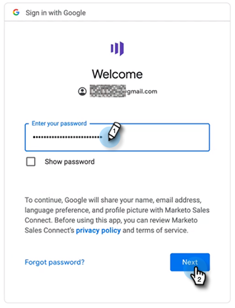

1. Click **Continue**.

   

>[!NOTE]
>
>If you choose Outlook, you'll see an Outlook Authentication screen where you will enter your email address.

1. You'll see Set Up Email Connection success message, then you'll be sent to the next screen.

   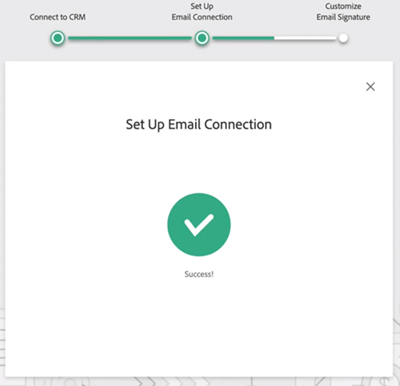

1. Enter your custom signature and click **Save** (if you want to do this later through your profile page, click **Skip**).

   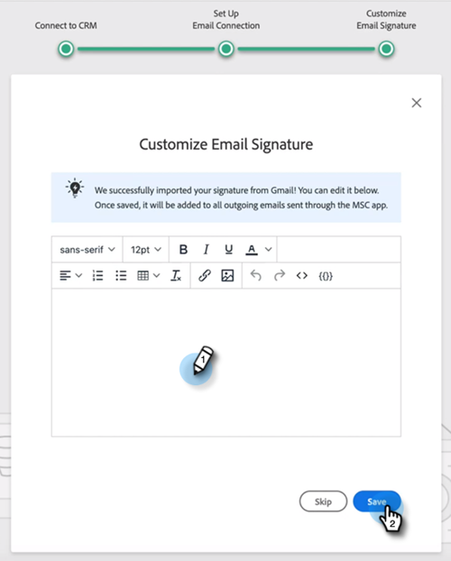

1. Click **Finish**.

   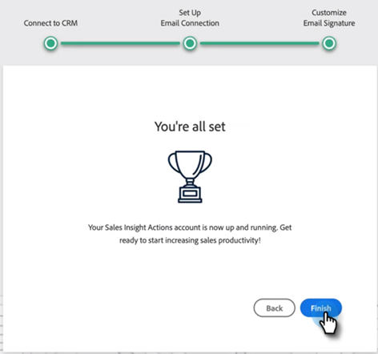

1. You see the option to view a quick intro to Marketo Sales Actions. Click **Next** to view, or **Not Now** to save for later.

   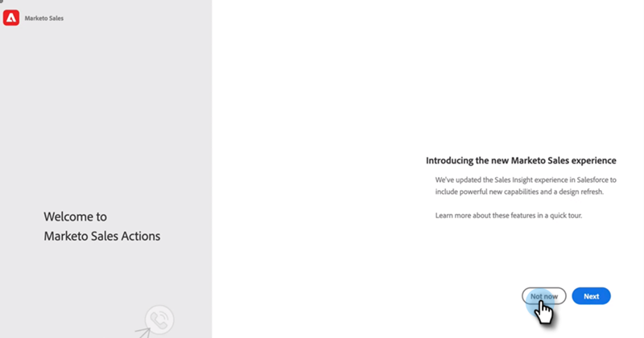

1. When you're done with the tour, or if you skipped it, choose whether to log in directly to the web application or your Salesforce account where you can access all the features from the MSI panel (in this example we're choosing **Launch Salesforce**).

   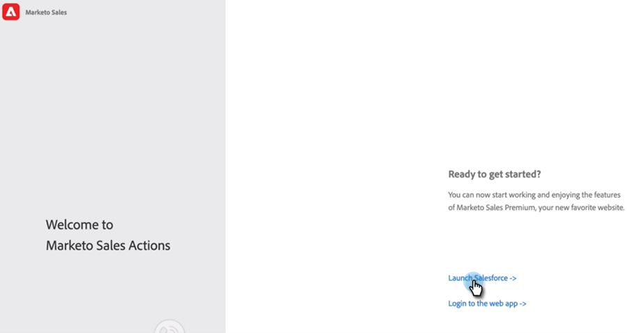

1. Inside Salesforce (Classic or Lightning), you can navigate to any lead, contact, account, or opportunity. All your Sales Actions will be available through the drop-down in the MSI panel.

   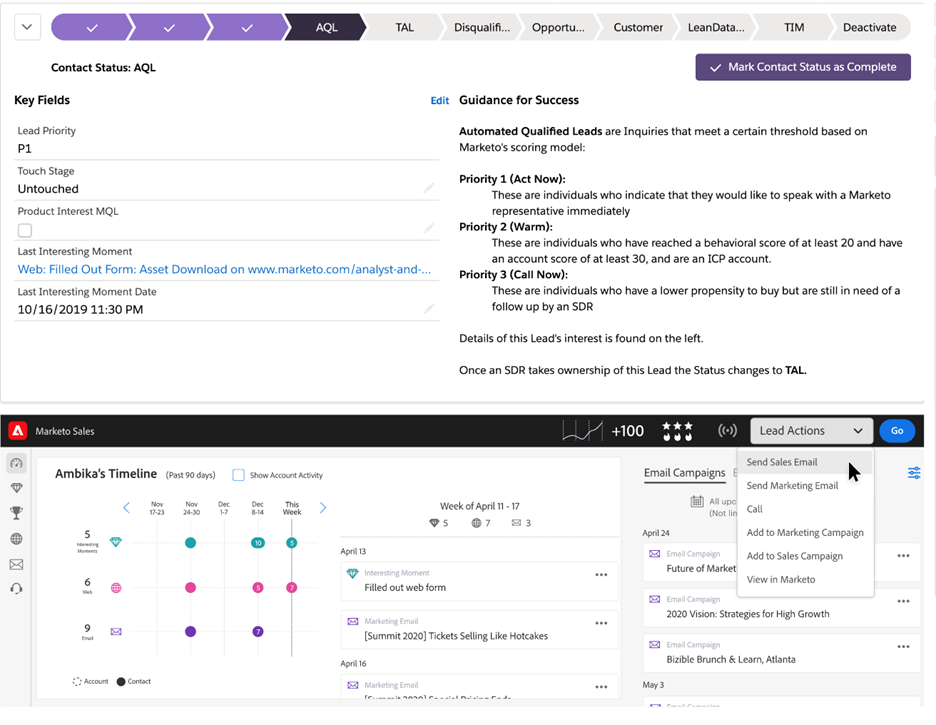
