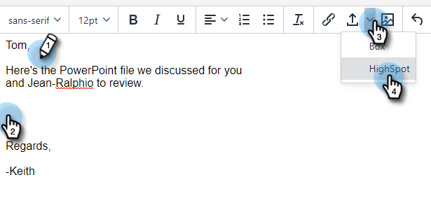

# Highspot Integration {#highspot-integration}

Sales can access Highspot capabilities from Sales Insight Actions and achieve greater visibility, efficiency, and performance throughout the sales cycle. Sales Insight Action users can select sales content stored on Highspot's sales enablement platform and insert it directly into emails, email templates, and sales campaigns, all while capturing content tracking and analytics within Highspot and Sales Insight Actions.

## Enabling Highspot Integration {#enabling-highspot-integration}

>[!NOTE]
>
>You must have Admin privileges to enable Highspot for your Sales Insight Actions instance.

1. Click the gear icon and select **Settings**.

   

1. Under **Admin Settings**, select **General**.

   

1. Scroll to **Integrations** card and click the slider to enable Highspot.

   

Now users will see an option to select Highspot when selecting the content upload button on the compose window, template editor, and campaign email editor.

   

## Accessing Highspot Content and Sharing Content via Email {#accessing-highspot-content}

Access Highspot and add content to your emails from the Sales Insight Actions compose window, template editor, and sales campaign email editor. Below are the steps on how to access content from the compose window.

1. Create your email draft (there are multiple ways to do this, in this example we're selecting **Compose** in the header).

   

1. Populate the To field and enter a Subject.

   

1. Write your message. Click the spot in the email where you want the Highspot content inserted. Click the arrow drop-down (next to the image icon) and select **Highspot**.

   

1. Log in to your Highspot account (if you're not logged in already).

   

1. Select your desired content and click the **Add Content** button.

   

   >[!TIP]
   >
   >If you don't quickly see the content you want, use the search bar at the top.

   The content appears as a link in your email. The recipient can click the link to view/download it.

   

## Tracking Clicks on Highspot Content {#tracking-clicks-on-highspot-content}

When recipients open content you send, you'll be notified in the live feed. The activity will show up as a click, with details about the content link. Additionally, the views on the content and downloads will be tracked in Highspot.

   
