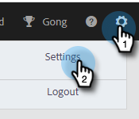
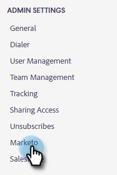
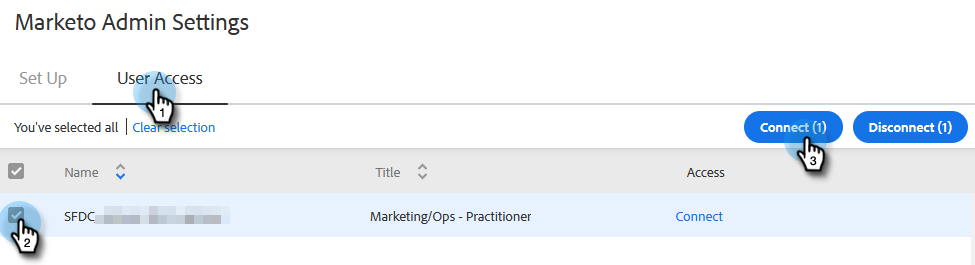
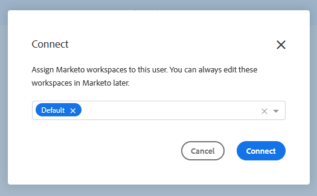
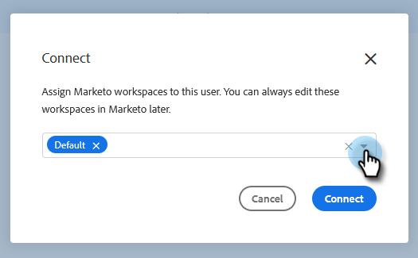
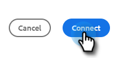

# Grant Marketo Access to Users {#grant-marketo-access-to-users}

Follow the steps in this article to grant your Marketo Sales users access to the Marketo connection. This will unlock features such as Interesting Moments in the Live Feed and access to Marketing Campaigns.

You'll need to [Marketo Sales](/help/marketo/product-docs/marketo-sales-insight/actions/admin/invite-users-and-admins.md#invite-users) before they're visible in the Marketo > Team Access page (in Marketo Sales), where access to the Marketo connection is granted.

>[!CAUTION]
>
>Please wait ten minutes after connecting Marketo Sales with Marketo before performing these steps.

1. Click the gear icon and select **Settings**.

   

1. Under Admin Settings, click **Marketo**.

   

1. Click the **User Access** tab. Select one or more users, then click **Connect**.

   

   >[!NOTE]
   >
   >You can only do the workspace assignment once at the time of granting access to users. After it's set, you'll have to disconnect the user in order to change it.

1. If your Marketo subscription has workspaces enabled, you'll be able to assign workspaces to each user or set of users in bulk. If no workspaces are selected, we’ll assign them to the Default Marketo workspace.

   

   **OPTIONAL STEP**: Click the Workspace drop-down and select your desired workspace(s).

   

1. Click **Connect**.

   

You can additional users from the Team Management page and follow the steps above to get them connected.
