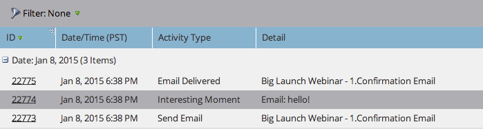
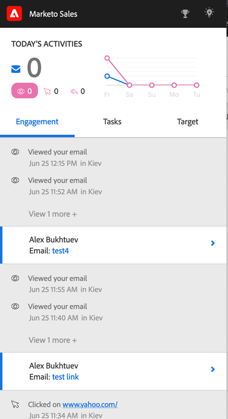

# Interesting Moments in Sales Insight Actions {#interesting-moments-in-sales-insight-actions}

Interesting moments are the key to communicating with your sales team through Marketo Sales Insight Actions.

## What is an interesting moment? {#what-is-an-interesting-moment}

That's up to you! You decide what information is relevant to your sales team. Your sales team might want to know when a lead:

* Visits the pricing page on your website
* Clicks a link in a new product announcement email
* Requests a product demo

## How do I create an interesting moment? {#how-do-i-create-an-interesting-moment}

1. Choose a [smart campaign](/help/marketo/product-docs/core-marketo-concepts/smart-campaigns/understanding-smart-campaigns.md){target="_blank"}, preferably one your sales team would find interesting if triggered.

   

1. Drag over the **Interesting Moments** flow step.

   

1. Select a **type** (Email, Milestone, or Web).

   

1. Write a message to your sales team in the **Description** field that explains why this action matters.

   

   >[!NOTE]
   >
   >Marketo will also add the date it occurred and how the interesting moment was added (i.e lead action > flow step, SOAP API).

## What does an interesting moment look like in Marketo?  {#what-does-an-interesting-moment-look-like-in-marketo}

Interesting moments will be displayed in a [lead's activity log](/help/marketo/product-docs/core-marketo-concepts/smart-lists-and-static-lists/managing-people-in-smart-lists/using-the-person-detail-page.md){target="_blank"}.

## What does an interesting moment look like in Sales Insight Actions? {#what-does-an-interesting-moment-look-like-in-sales-insight-actions}

Interesting Moments will be displayed in real time in a user's Live Feed. We utilize the lead owner ID in Salesforce to show users' interesting moments of relevant leads that they're the owner of. Users can quickly follow up with leads via email/phone/sales campaign by clicking the drop-down next to the lead's name.

