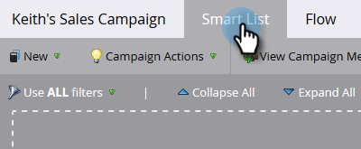
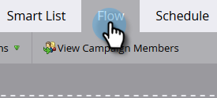

# Make a Marketing Campaign Visible in the Sales Insight Actions UI {#make-a-marketing-campaign-visible-in-the-sales-insight-actions-ui}

Campaigns can only be shared if they're made visible.

With Sales Insight Actions, users will have access to a new sales app called toutapp.com. This app gives them a new set of action capabilities, but also inherits the _Add to Marketing Campaign_ feature available in the core version of Sales Insights. This is important to keep in mind, because depending on where you you want users to access the Add to Marketing Campaign feature (toutapp.com or the MSI SFDC package experience), your Marketo campaigns will need to be configured differently. See the note in Step 4 to learn more.

1. Select (or create) the Campaign you want shared.

   

1. Click the **Smart List** tab.

   

1. Add the Campaign is Requested trigger.

   

1. For source, choose "is" **Web Service API**.

   

   >[!NOTE]
   >
   >If you want to show the marketing campaign to users who are utilizing _Add to Marketing Campaign_ from the toutapp.com web app (this also includes if you have the web app embedded into the CRM via the Marketo Sales Outbox object), set it to "Web Service API." If you want the marketing campaign to show up when a user uses the actions on the MSI panel in Salesforce on the lead, contact, account page, or the bulk action buttons on the lead and contact list views, update it to "Sales Insight"

1. Click the **Flow** tab.

   

1. Add the Interesting Moment flow action.

   

1. For Type, select **Web**.

   

1. In the Description box, write a message to your sales team. In this example we're using tokens to specify the form that was filled out.

   

1. Click the **Schedule** tab and **Activate** the campaign.

   
