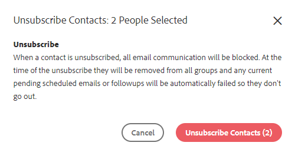

# Bulk Actions on People {#bulk-actions-on-people}

There are a few things you can do with your contacts in bulk to save time.

The first step for all of the available bulk actions is to select two or more contacts, and click the dota (three vertical dots).

## Add People to Group {#add-people-to-group}

Add multiple people to a group at the same time.

## Source {#source}

We automatically assign a source to every contact that enters the database. Use this step to update that source.

>[!NOTE]
>
>Sources are not customizable.

## Authorization {#authorization}

In compliance with [GDPR](https://eugdpr.org/), use authorization to indicate how you received permission to engage with these contacts.

## Unsubscribe {#unsubscribe}

Perform a bulk unsubscribe on contacts who no longer wish to receive correspondence from you.

