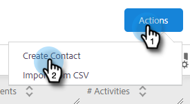
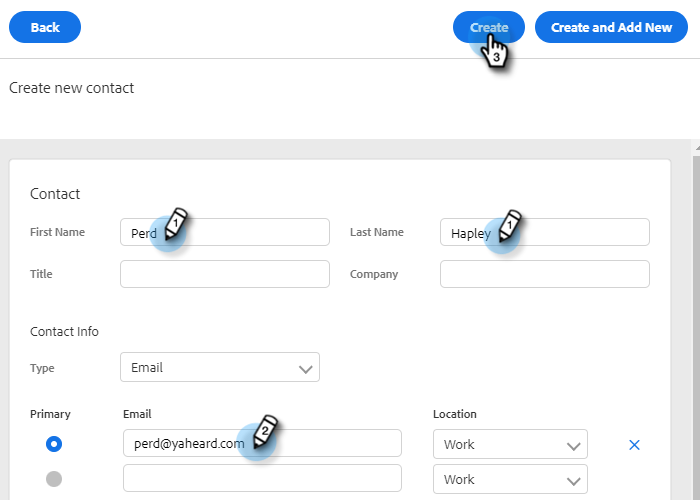
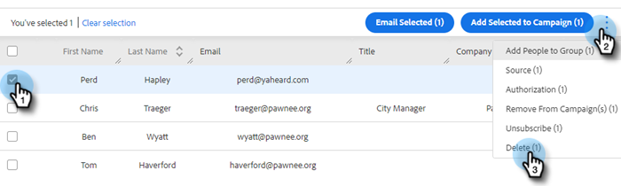
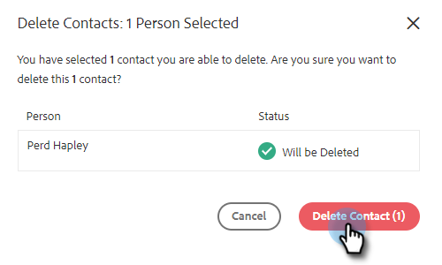

# Creating and Deleting Contacts {#creating-and-deleting-contacts}

## Creating Contacts {#creating-contacts}

1. In the People page, click the **Actions** button and select **Create Contact**.

   

1. Enter the first/last name and email address, along with any other info you'd like. Click **Create** when done, or **Create and Add New** to add more contacts.

   

   >[!TIP]
   >
   >Want to add multiple contacts at once? [Click here](/help/marketo/product-docs/marketo-sales-insight/actions/people/managing-contacts/import-contacts-via-csv.md) to learn how to import contacts via CSV.

## Deleting Contacts {#deleting-contacts}

1. In the People page, check the box of the contact you’d like to delete. Click the dota (three vertical dots) and select **Delete**.

   

   >[!NOTE]
   >
   >To delete multiple contacts, simply select multiple people. The remaining steps would be the same.

1. Click **Delete Contact** to confirm.

   
