# Manage Groups {#manage-groups}

Learn how to manage your groups in Sales Insight Actions.

## Group Types {#group-types}

<table> 
 <colgroup> 
  <col> 
  <col> 
 </colgroup> 
 <tbody> 
  <tr> 
   <th>Group</th> 
   <th>Description</th> 
  </tr> 
  <tr> 
   <td>All People</td> 
   <td>All contacts from all users that are visible to you.</td> 
  </tr> 
  <tr> 
   <td>Dynamic Groups</td> 
   <td>My Contacts: All of the contacts you own. Unsubscribes: Contacts who have opted-out from receiving correspondence.</td> 
  </tr> 
  <tr> 
   <td>My Groups</td> 
   <td>Groups you've created. They can contain your contacts, or contacts that have been shared with you.</td> 
  </tr> 
  <tr> 
   <td>Team Groups</td> 
   <td>Groups that have been shared with and/or by you. They can contain contacts your teammates own, or contacts you've shared with them.</td> 
  </tr> 
 </tbody> 
</table>

## Create a Group {#create-a-group}

1. In the People page, click the **+** next to Groups.

   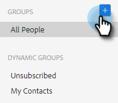

1. Name your group and click **Create**.

   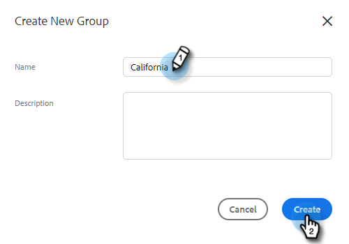

   That's it!

## Add Contacts to a Group {#add-contacts-to-a-group}

1. In the People page, find and select the group you want to add people to.

   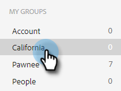

1. Click **Group Actions** and select **Create Contact and add to Group**.

   

   >[!NOTE]
   >
   >This will add one contact at a time. To add multiple contacts at the same time, follow [these steps](/help/marketo/product-docs/marketo-sales-insight/actions/people/managing-contacts/import-contacts-via-csv.md).

1. Fill out the contact's information and click **Create** (or **Create and Add New** to add another).

   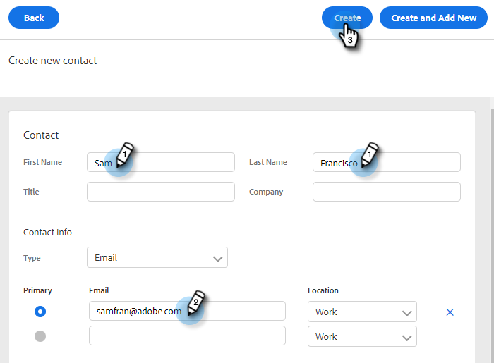

   And you're done!

   >[!NOTE]
   >
   >You might have to hit refresh to see any new contacts added.

## Share a Group {#share-a-group}

1. In the People page, find and select the group you want to share.

   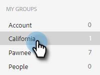

1. Click the dota (three vertical dots) and select **Share**.

   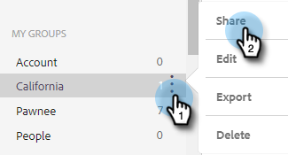

1. Click the drop-down, choose the team you want to share the group with and click **Share**.

   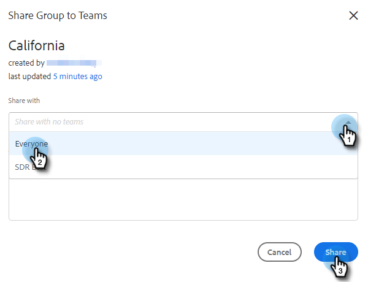

   You still own the group, but it will now appear under _Team Groups_.

## Unshare a Group {#unshare-a-group}

1. In the People page, find and select the group you want to unshare.

   

1. Click the dota (three vertical dots) and select **Share**.

   

1. Click the **X** next to the team you shared the group with, then click out of the modal.

   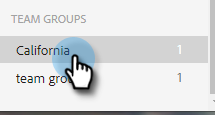

   The group is now unshared.

## Rename a Group {#rename-a-group}

1. In the People page, find and select the group you want to rename.

   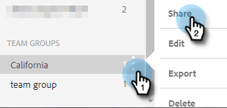

1. Click the dota (three vertical dots) and select **Edit**.

   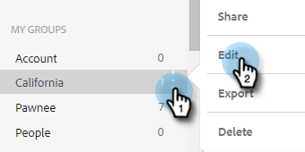

1. Type in the new name and click **Save**.

   

## Delete a Group {#delete-a-group}

1. In the People page, find and select the group you want to delete.

   

1. Click the dota (three vertical dots) and select **Delete**.

   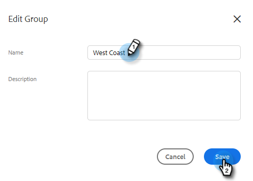

1. Click **Delete** to confirm.

   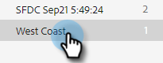
