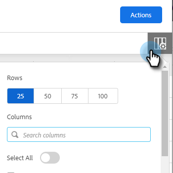
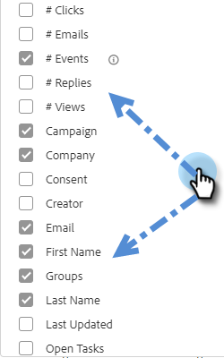

# People Page Columns {#people-page-columns}

You have the option of customizing what contact information you see by choosing which columns are displayed.

## How to Select Columns {#how-to-select-columns}

1. In the People page, click the List Settings icon.

   

1. Scroll through and select your desired columns (you can also click **Select All** if you want every column). Click out of the list when done.

   

## Column Descriptions {#column-descriptions}

<table> 
 <colgroup> 
  <col> 
  <col> 
 </colgroup> 
 <tbody> 
  <tr> 
   <th>Column</th> 
   <th>Description</th> 
  </tr> 
  <tr> 
   <td>First Name (default)</td> 
   <td>First Name</td> 
  </tr> 
  <tr> 
   <td>Last Name (default)</td> 
   <td>Last Name</td> 
  </tr> 
  <tr> 
   <td colspan="1">Email (default)</td> 
   <td colspan="1">Email Address</td> 
  </tr> 
  <tr> 
   <td colspan="1">Phone</td> 
   <td colspan="1">Phone number</td> 
  </tr> 
  <tr> 
   <td colspan="1">Title (default)</td> 
   <td colspan="1">Job title</td> 
  </tr> 
  <tr> 
   <td>Company (default)</td> 
   <td>Company name</td> 
  </tr> 
  <tr> 
   <td>Campaign (default)</td> 
   <td>Sales campaign the person is currently on</td> 
  </tr> 
  <tr> 
   <td># Campaigns</td> 
   <td>Total number of sales campaigns the person has been a part of</td> 
  </tr> 
  <tr> 
   <td># Calls</td> 
   <td>Total number of calls that has been made to this person</td> 
  </tr> 
  <tr> 
   <td># Emails</td> 
   <td>Total number of emails sent to this person</td> 
  </tr> 
  <tr> 
   <td>Task Due Date</td> 
   <td>Due date of task</td> 
  </tr> 
  <tr> 
   <td># Events (default)</td> 
   <td>Total number of engagement events by the person (Views, clicks, and replies)</td> 
  </tr> 
  <tr> 
   <td># Activities (default)</td> 
   <td>Total number of activities taken by the user for this lead (emails, calls, and tasks)</td> 
  </tr> 
  <tr> 
   <td>Consent</td> 
   <td>
Legitimate Interest, Performance of a Contract, Compliance with Legal Obligation, Protection of Vital Interests, Public Interest/Official Authority, and Other
</td> 
  </tr> 
  <tr> 
   <td>Open Tasks</td> 
   <td>Number of open tasks for this person</td> 
  </tr> 
  <tr> 
   <td># Views</td> 
   <td>Total number of views by this person</td> 
  </tr> 
  <tr> 
   <td># Clicks</td> 
   <td>Total number of clicks by this person</td> 
  </tr> 
  <tr> 
   <td># Replies</td> 
   <td>Total number of replies by this person</td> 
  </tr> 
  <tr> 
   <td>Last Updated</td> 
   <td>Date the person record was last updated at</td> 
  </tr> 
  <tr> 
   <td>Creator</td> 
   <td>Name of user that created the person</td> 
  </tr> 
  <tr> 
   <td>Source</td> 
   <td>Source of where the person was created from</td> 
  </tr> 
  <tr> 
   <td>Groups (default)</td> 
   <td>Groups that the person is a part of</td> 
  </tr> 
  <tr> 
   <td colspan="1">Unsubscribed</td> 
   <td colspan="1">Sales unsubscribe status</td> 
  </tr> 
 </tbody> 
</table>
