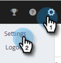
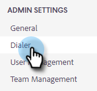
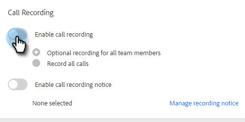
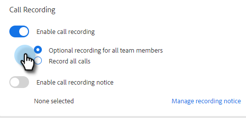

# Enable Call Recording {#enable-call-recording}

As an admin you can enable call recording for your Sales Insight Actions calls. Recording your team's calls can be a great way to coach your sales reps on the best calling practices.

1. Click the Settings icon and select **Settings**.

   

1. Under Admin Settings, click **Dialer**.

   

1. Select the **Enable call recording** toggle.

   

1. If you want to give your sellers the ability to enable or disable call recording for themselves, click **Optional recording for all team members**. If you want all calls recorded automatically, click **Record all calls**.

   

>[!MORELIKETHIS]
>
>[Two-Party Consent Settings](/help/marketo/product-docs/marketo-sales-insight/actions/phone/two-party-consent-settings.md)
