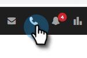
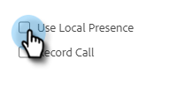

# Local Presence {#local-presence}

Local Presence gives you the option of making it look like you're calling from your recipient's same area code.

## Select Local Presence {#select-local-presence}

1. Click the phone icon to open the Sales Dialer.

   

1. Select the **Use Local Presence** checkbox.

   

## FAQ {#faq}

**Can my contact call me back at this new number?**

No, local presence only works for Outbound calls. The caller cannot call you back at this “new” number.

**Can I call anywhere with Local Presence?**

We offer all Sales Phone functionality for calls in the U.S. only.

**Is the local presence number always the same when I call an area code?**

The number will likely always be the same when you are calling into an area code.

**Does my entire number change or just the area code when using local presence?**

Your entire number will change.
