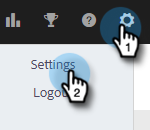
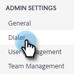
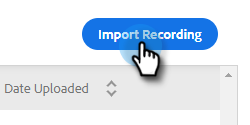
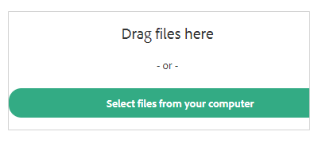
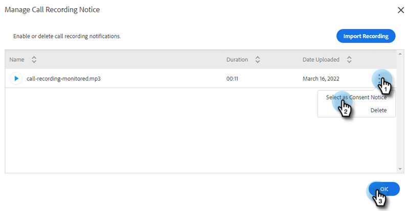
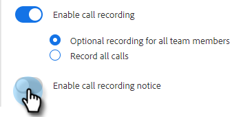

# Two-Party Consent Settings {#two-party-consent-settings}

In order to ensure compliance with U.S. two-party consent laws when recording calls, as an Admin you can enable a prerecorded message of your choice to play at the beginning of your calls when it's being recorded.

>[!PREREQUISITES]
>
>Before following the steps below, you must first [enable call recording](/help/marketo/product-docs/marketo-sales-insight/actions/phone/enable-call-recording.md).

1. Click the Settings icon and select **Settings**.

   

1. Under Admin Settings, click **General**.

   

1. In the Call Recording card, click **Manage recording notice**.

   

1. Click **Import Recording**.

   

   >[!NOTE]
   >
   >Only Wav and MP3 files are supported. You cannot upload a file longer than 30 seconds.

1. Select the desired audio file(s) from your hard drive.

   

1. Once the upload is complete, select the dota (three dots) in the file manager and click **Select as Consent Notice**. Click **OK** when done.

   

1. Click the toggle to enable the selected message be played at the beginning of your recorded calls.

   
