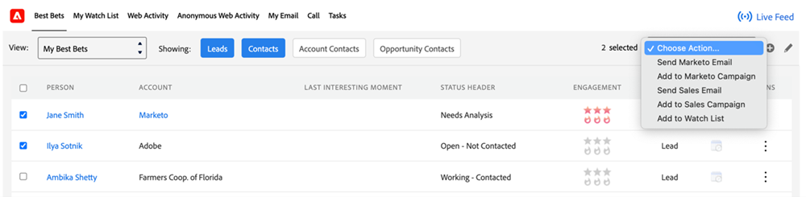
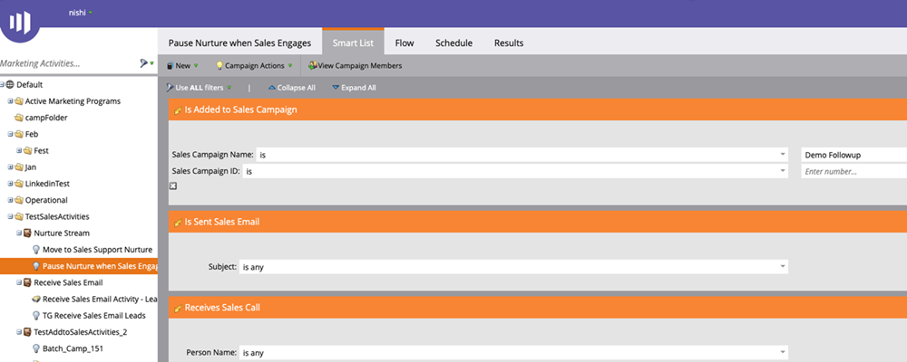

# Sales Insight Actions Feature Overview {#msi-actions-feature-overview}

Accelerate prospecting efforts with marketing-powered intelligence and engagement tools together in a single workflow using Sales Insight Actions.

   

## Lead Layout and Contact Layout {#lead-layout-and-contact-layout}

The following actions are available from the “Choose Actions” drop down in the top nav:

* Send Sales Email
  * Sales emails have view, click and reply tracking (when delivery channel is set up)
  * Includes Email Personalization, Customized Signature, and attachments
  * Template sharing and reports
  * Team sharing, group emails, and CC/BCC ability
  * Sales email activity will be logged in the Marketo person record
  * Corresponding filters and triggers in Marketo Smart Campaigns (details below)

* Add to Sales Campaign
  * Add leads to sales playbooks which is a sequence of emails and tasks
  * Includes team access and sharing, task generation, skip weekends, ignore OOO emails as replies, and auto end
  * Campaign activity will be logged in the Marketo person record
  * Corresponding filters and triggers in Marketo Smart Campaigns (details below)

* Sales Dialer
  * Make sales calls using the dialer within the CRM
  * Includes local presence, pre-recorded
  * Log call outcome, call recording in panel, and activity history
  * Call activity will be logged in the Marketo person record
  * Filters and Triggers in Marketo Smart Campaigns

* Add Task
  * Create Email, Call, InMail, and Custom tasks for your leads
  * Automate task creation with Sales Campaigns
  * Sync tasks with Salesforce  
  * Log tasks in Salesforce Activity History section

You can access Live Feed by clicking on the ((0)) icon in the top nav. It includes the ability to see live updates on sales activities along with screen docking capability.

   

The following data is available in the tabs within the MSI panel:

* Insights Dashboard
  * Engagement Velocity Grid will include activities from Sales Emails, Sales Campaign Actions, and Sales Dialer
  * Upcoming Sales Campaigns - When a lead is a part of an ongoing campaign, this information will be available in the upcoming sales campaigns tab
  * Upcoming Tasks - When there is an upcoming task pertaining to a lead, this information will be available in the upcoming tasks tab

* Email Tab
  * All sales emails sent will be logged here. The activities will also be logged in the Marketo person record
  * Columns include Subject, Open, Click, Replied (available only for sales email with delivery channel set up), Sender, Date
  * Includes slide out card with additional details like Sender, Template, Sales Campaign, and Preview Email

* Call Tab
  * All calls placed using the sales dialer feature will be logged here. The activities will also be logged in the Marketo person record
  * Columns include Name, Outcome, Notes, Called At, Duration, and link to recording
  * Includes slide out card with additional details like Call Made By, Call Answered By, Phone Number, and Status

## Account and Opportunity Layout {#account-and-opportunity-layout}

The following actions are available from the top nav:

* Send Sales Email - Ability to send personalized or templatized group emails with view, click and reply tracking to all contacts associated to an account/opportunity
  * Sales emails have view, click and reply tracking (when delivery channel is set up)
  * Includes Email Personalization, Customized Signature, and attachments
  * Template sharing and reports
  * Team sharing, group emails, and CC/BCC ability
  * Sales email activity will be logged in the Marketo person record
  * Corresponding filters and triggers in Marketo Smart Campaigns (details below)

* Add to Sales Campaign - Add all contacts associated to an account/opportunity to sales playbooks which is a sequence of emails and tasks
  * Add leads to sales playbooks which is a sequence of emails and tasks
  * Includes team access and sharing, task generation, skip weekends, ignore OOO emails as replies, and auto end
  * Campaign activity will be logged in the Marketo person record
  * Corresponding filters and triggers in Marketo Smart Campaigns (details below)

You can access Live Feed by clicking the ((0)) icon in the top nav. It includes the ability to see live updates on sales activities along with screen docking capability.

The following data is available in the tabs:

* Insights Dashboard
  * Engagement Velocity Grid will include activities from Sales Emails, Sales Campaign Actions, and the Sales Dialer
  * Upcoming Sales Campaigns - When a contact from the account/opportunity is a part of an on-going campaign, this information will be available in the upcoming sales campaigns tab
  * Upcoming Tasks - When there's an upcoming task pertaining to a contact from the account/opportunity, this information will be available in the upcoming tasks tab

* Email Tab
  * All sales emails sent to contacts from the account/opportunity will be logged here. The activities will also be logged in the Marketo person record
  * Columns include Subject, Open, Click, Replied (available only for sales email with delivery channel set up), Sender, and Date
  * Includes slide out card with additional details like Sender, Template, Sales Campaign, and Preview Email

* Call Tab
  * All calls made to contacts from the account/opportunity using the sales dialer feature will be logged here. The activities will also be logged in the Marketo person record
  * Columns include Name, Outcome, Notes, Called At, Duration and link to recording
  * Includes slide out card with additional details like Call Made By, Call Answered By, Phone Number, and Status

## Lead and Contact List View (Bulk Actions) {#lead-and-contact-list-view}

* Send Sales Email - Ability to send personalized or templatized emails with view, click and reply tracking to a list of contacts/leads
* Send Sales Campaign - Add to sales playbooks which is a sequence of emails and tasks to a list of contacts/leads

## Marketo Global Tab {#marketo-global-tab}

**Best Bets Tab**

   

The following bulk actions are available from the drop down in Best Bets tab:

* Send Sales Email - Ability to send personalized or templatized emails with view, click and reply tracking
* Send Sales Campaign - Add leads to sales playbooks which is a sequence of emails and tasks

   

The following in-line actions are available for individual leads/contacts in the Best Bets tab:

* Send Sales Email - Ability to send personalized or templatized emails with view, click and reply tracking
* Send Sales Campaign - Add leads to sales playbooks which is a sequence of emails and tasks
* Sales Dialer - Make sales calls using the dialer within the CRM
* Add Task - Create email, call, customer or Linkedin tasks for prospective leads

   

**Email Tab**

* All sales emails sent will be logged here. The activities will also be logged in the Marketo person record
* Columns include Subject, Open, Click, Replied (available only for sales email with delivery channel set up), Sender, and Date
* Includes slide out card with additional details like Sender, Template, Sales Campaign, and Preview Email

**Call Tab**

* All calls placed using the sales dialer feature will be logged here. The activities will also be logged in the Marketo person record
* Columns include Name, Outcome, Notes, Called At, Duration and link to recording
* Includes slide out card with additional details like Call Made By, Call Answered By, Phone Number, and Status

**Task Tab**

* Email, Call, InMail, and Custom tasks created and completed will be available for task management in this tab. Includes ability to Add Task
* Automate task creation with Sales Campaigns
* Sync tasks with Salesforce  
* Log tasks in Salesforce Activity History section

   

**Live Feed**

* Ability to see live updates on sales activities along with screen docking capability
* Embedded email, call, and cadence buttons makes every customer insight actionable

## Features Available in Marketo {#features-available-in-marketo}

Sales activities that are captured in Marketo:

* Send Sales Email - User sent a sales email to a lead
* Open Sales Email - Lead opened a sales email sent  
* Click Sales Email - Lead clicked on a link in a sales email
* Replied Sales Email - Lead replied to a sales email  
* Receive Sales Call - Lead received a call from a salesperson using the Sales Dialer.
* Add to Sales Campaign - Lead was added to a sales campaign created  
* Removed from Sales Campaign - Lead was removed from a sales campaign created  

Filters and Triggers include:

* Send Sales Email
* Opened Sales Email
* Clicked Sales Email
* Replied to Sales Email
* Received Sales Call
* Added to Sales Campaign
* Removed from Sales Campaign

   
