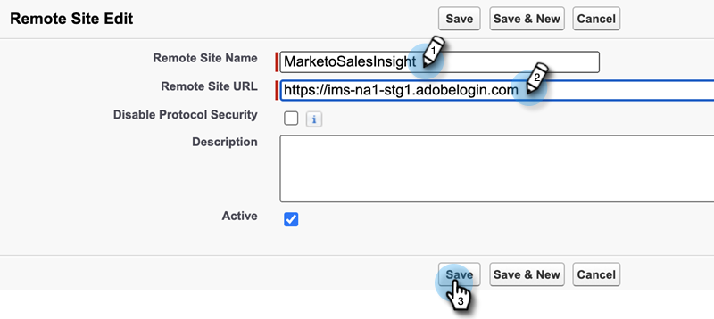

# MSI Actions Configuration in Salesforce {#msi-actions-configuration-in-salesforce}

>[!PREREQUISITES]
>
>* [Install]() or [Upgrade]() Sales Insight Package in your Salesforce instance
Install/Upgrade to the [MSI Actions Package](/help/marketo/product-docs/marketo-sales-insight/msi-for-salesforce/configuration/configure-marketo-sales-insight-in-salesforce-enterprise-unlimited.md) in your Salesforce instance.
>* [Configure Marketo Sales Insight in Salesforce Enterprise/Unlimited]()

## Add New Remote Site in Salesforce {#add-new-remote-site-in-salesforce}

1. In Salesforce, click **Setup**.

   

1. Search for “remote site" and select **Remote Site Settings**.
   

1. Click **New Remote Site**.

   

1. Enter the Remote Site Name (it can be something like “MarketoSalesInsight”). Enter the Remote Site URL (https://ims-na1-stg1.adobelogin.com) and click **Save**.

   

## Enabling MSI-Actions across the CRM {#enabling-msi-actions-across-the-crm}

1. In Salesforce, click the **Marketo Sales Insight Config** tab.

   

   >[!NOTE]
   >
   >If you don't see "Marketo Sales Insight Config" in your top bar, click the **+** sign and find it under All Tabs.

1. Select the **Enable MSI Actions** checkbox.

   

1. Enter the API Secret Key.

   

   >[!NOTE]
   >
   >If you don't have your API Secrey Key handy, you can find it by following the steps in [this article](/help/marketo/product-docs/marketo-sales-insight/msi-for-salesforce/configuration/configure-marketo-sales-insight-in-salesforce-enterprise-unlimited.md).

1. Click **Save** when done.

This will automatically enable all MSI Actions features outlined in the feature overview article.

>[!NOTE]
>
>You can disable all MSI Actions features by simply unchecking the “Enable MSI Actions” checkbox.

## MSI-Actions Governance {#msi-actions-governance}

1. You can disable Sales Campaigns and/or the Task tab in the upcoming section. This will be applicable to lead, contact, account, and opportunity panels.

   

1. You can disable MSI Actions by unchecking corresponding features under Actions settings.

   

>[!NOTE]
>
>Governance settings are applicable to all MSI users.
