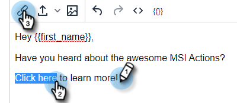
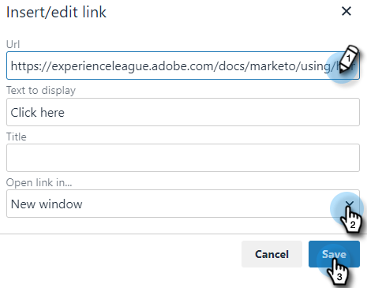
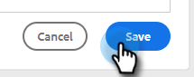

# Add Hyperlinked Text {#add-hyperlinked-text}

Follow the steps below to learn how to add hyperlinks to your email templates.

1. In the Templates page, select the desired template (or create a new one).

   

1. Click **Edit**.

   

1. Type out the text you want hyperlinked (i.e., "Click Here"). Highlight it and click the link button in the editor.

   

1. Enter the URL you wish it to be linked to (i.e., `https://experienceleague.adobe.com/docs/marketo/using/home.html`). Choose whether you want the URL to open in the same or new window and click **Save**.

   

1. Click **Save** again.

   

>[!NOTE]
>
>If the template you edit is currently being used as an email step in any campaigns, you'll be given the option to update the wording for specific (or all) campaigns.
