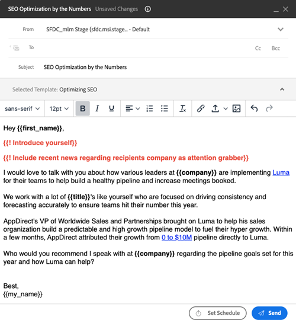

# Field Prompts {#field-prompts}

Field prompts allow you to add a string of text to emails that need to be removed or replaced before the email can be sent. This is a great way to remind users to add additional personalization.

To add a field prompt, type out the desired text. Preface it with an exclamation mark and surround it with curly brackets (see below).

**Examples:**

`{{! Introduce yourself}}`

`{{! Insert name of Account Executive}}`

`{{! Add sentence that references their industry and role}}`

Users will need to replace this text with their own personalization before the email can be sent.

   

>[!NOTE]
>
>When using prompts with Sales Campaigns, it's best to use them with manual email steps. These steps will assign a user a reminder task to send the email, giving them an opportunity to replace the prompts with custom text. Automatic email steps in Sales Campaigns will attempt to automatically send, without allowing the user to replace the prompts. Prompts that are not replaced will cause the emails to fail to send.
