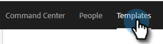
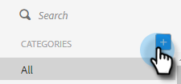
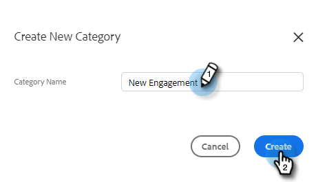
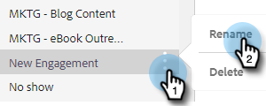
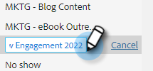
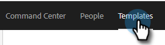
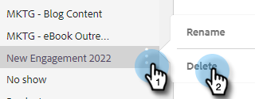
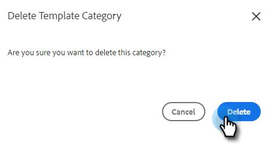

# Manage Template Categories {#manage-template-categories}

## Create a Category {#create-a-category}

1. Click the **Templates** tab.

   

1. Click the **+** icon next to **Categories**.

   

1. Enter a name for your new category, then click **Create**.

   

## Rename a Template Category {#rename-a-template-category}

1. Click the **Templates** tab.

   

1. Hover over the template you want to rename and click the dota (three dots). Select **Rename**.

   

1. Type in the new name. Press enter (or just click elsewhere on the screen) to save.

   

## Delete a Template Category {#delete-a-template-category}

1. Click the **Templates** tab.

   

1. Hover over the template you want to rename and click the dota (three dots). Select **Delete**.

   

1. Click **Delete** to confirm.

   

>[!NOTE]
>
>Categories cannot be deleted if they still have templates in them. Move or delete all templates before deleting a category.
