# Manage Templates {#manage-templates}

## Create a Template {#create-a-new-template}

1. Navigate to the **Templates** tab.

   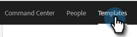

1. Click **Create Template**.

   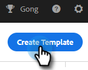

1. Choose a **Name** and **Category** for your email template, then click **Create**.

   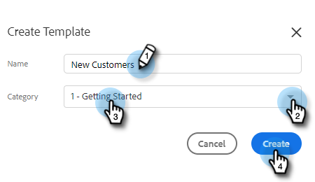

1. In the template editor, create a subject line for your email and type the desired message. Use the editing tools (font, text size, etc.) to customize the appearance. Click **Save** to finalize your changes.

   

>[!TIP]
>
>Always type text directly into the template, or copy from a plain text editor (e.g., Notepad or TextEdit). Copying and pasting from a rich text editor (e.g., MS Word) can cause formatting irregularities.

## View Template Details {#view-template-details}

The Template Details area contains multiple tabs.

   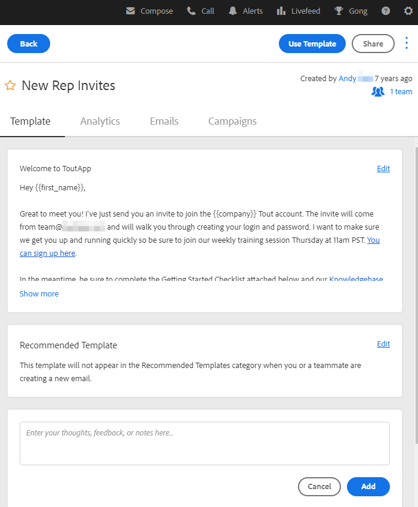

<table>
 <tr>
  <td><strong>Template</strong></td>
  <td>Review and make edits, set up criteria to make the template a recommended template, add notes</td>
 </tr>
 <tr>
  <td><strong>Analytics</strong></td>
  <td>Review engagement analytics for the template. Perform a filtered search.</td>
 </tr>
 <tr>
  <td><strong>Emails</strong></td>
  <td>View all emails that have been sent using this template. Perform a filtered search.</td>
 </tr>
 <tr>
  <td><strong>Campaigns</strong></td>
  <td>See which Campaigns the template is being used in.</td>
 </tr>
</table>

## Share a Template {#share-a-template}

If you're using one of our team accounts, all of your templates are still private by default.

1. Navigate to the **Templates** tab.

   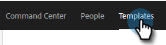

1. Find and choose the desired template.

   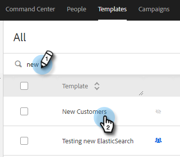

1. Click the **Share** button.

   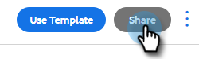

   >[!NOTE]
   >
   >Templates that have been shared with you will show up under the **Team Templates** header on the left hand side of the Templates page. Teams are only available for Premium users.

1. Click the Share With drop-down and select the team(s) with which you'd like to share.

   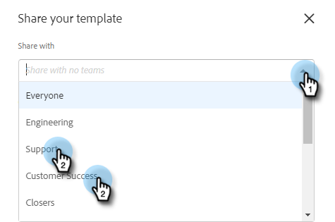

1. You have the option of keeping the template in the current category or moving it to a different one. In this example we're keeping it in the current one. Click **Share** when done.

   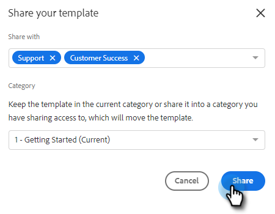

## Favorite a Template {#favorite-a-template}

You can add templates from any category to your Favorites list. This automatically generates a new category at the top of your list so you can quickly access the templates you use most.

1. Navigate to the **Templates** tab.

   

1. Find the desired template and hover over it. Click the star that appears to the left of the template name.

   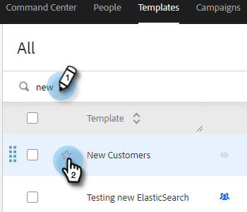

   After it's favorited, the star will remain.

   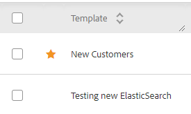

## Customize Template View {#customize-template-view}

From the **View** drop-down, you can choose to see: all templates, your templates, favorite templates, shared templates, unshared templates, or unused templates (templates that haven't been used in the last 90 days).

   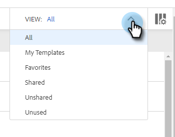

>[!NOTE]
>
>Additionally, you can add/remove columns in your template view by clicking the settings icon to the right of the view drop-down.

## Archive a Template {#archive-a-template}

Archive templates to keep your sales content organized and focused without losing any template data.

1. Check the box next to the template you want to archive.

   

1. Click **Archive**.

   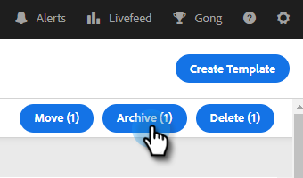

1. Click **Archive** to confirm.

   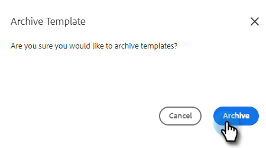

>[!NOTE]
>
>Once a template is archived, it cannot be edited or used. To use it again, move the template out of Archive and into any other category.

You can also select the Unused filter to view and archive templates that haven't been used in over 90 days.

## Delete a Template {#delete-a-template}

Follow the steps below to delete a template.

>[!CAUTION]
>
>Deleting a template will also delete ALL tracking and analytics associated with it.

1. Check the box next to the template you want to delete.

   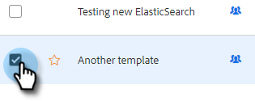

1. Click **Delete**.

   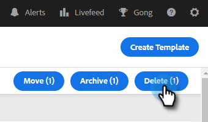

1. Click **Delete** to confirm.

   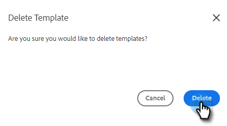
