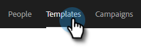
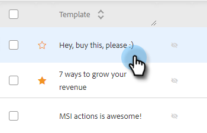
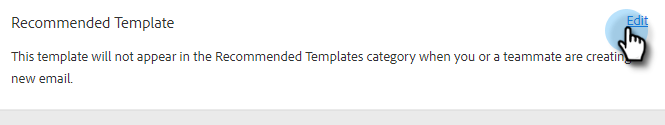
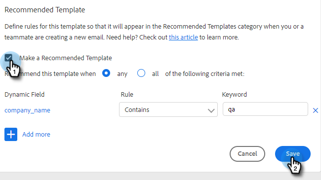

# Recommended Templates {#recommended-templates}

Sales Insight Action’s Recommended Templates help you get the right messaging while saving you time. This gives you greater flow when sending emails and reduces uncertainty when trying to find the right email for the right person.

1. Go to your Templates tab.

   

1. Select the template you'd like to recommend.

   

1. In the Recommended Template card, click **Edit**.

   

1. Select the **Make a Recommended Template** checkbox and click **Save**.

   

>[!NOTE]
>
>To learn more about template criteria, see below.

## All vs. Any {#all-vs-any}

Select **All** if you'd like your template to be recommended when all of the criteria is met. Select **Any** if you'd like your template to be recommended when any one of the criteria is met.

## Setting Criteria {#setting-criteria}

Your criteria is going to set the conditions for which templates will be recommended. You can set a maximum of 3 pieces of criteria. First select the Dynamic Fields you would like to be pointed at in your template.

## Conditions {#conditions}

Now, select your condition. When your conditions for your dynamic field are met, the template will be recommended. Choose from 4 different conditions.

**Equals**: Value must be an exact match (e.g., Marketo equals Marketo)

**Does not Equal**: Value must be anything but an exact match (e.g., Marketing Nation does not equal Marketing)

**Contains**: Only needs to contain the value (e.g., Marketo Rocks! contains Marketo)

**Does Not Contain**: The Value must not be in the Dynamic Field (e.g., Marketo Rocks! does not contain Awesome)

## What A Recommended Template Looks Like {#what-a-recommended-template-looks-like}

Now that you've mapped out your first template, it’s time to map out the rest. Go through your most successful templates and recommend them. Don’t forget to share the template with your team as well. Your recommended settings for any templates will also be shared among your team.
