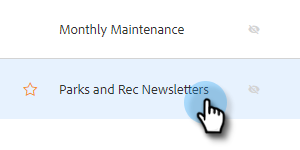
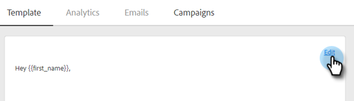
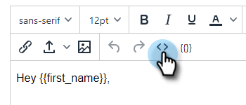
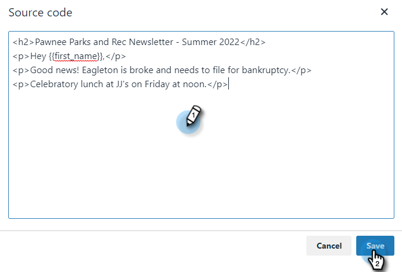

# Using HTML {#using-html}

1. Copy the source code from your emails in the tool you use to create emails in HTML (e.g., Marketo's Email Editor).

1. Select template you'd like to add the HTML to.

   

1. In the Template Editor card, click **Edit**.

   

1. Click the **Source** button in your template editor.

   

1. Paste the source code and click **Save**.

   

>[!NOTE]
>
>If you see the error "Error - to remove the style/java/html tags," it means you have some styling we don't support. You should search the Source code for the word style and delete everything from ``.
