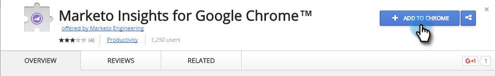
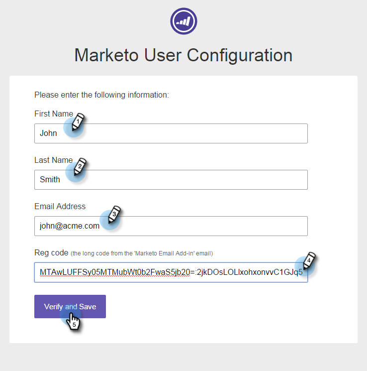
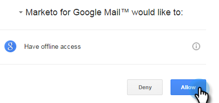

# Install Marketo Insights for [!DNL Google Chrome] {#install-marketo-insights-for-google-chrome}

Follow these steps to begin using the powerful [!DNL Chrome] add-in.

>[!NOTE]
>
>You do not need to be a Marketo admin to install the extension.

1. Install the [Marketo Insights for Google Chrome Add in extension](https://chrome.google.com/webstore/detail/marketo-for-google-mail/jjkfbhajlmoeegbjgjipliamplidmbjb) from the [!DNL Chrome] Web Store.

   

1. Right-click on the Marketo logo in [!DNL Chrome] and select **[!UICONTROL Options]**.

   

1. Enter your **[!UICONTROL Reg code]**, **[!UICONTROL Email Address]**, **[!UICONTROL First Name]**, and **[!UICONTROL Last Name]**. Click **[!UICONTROL Verify and Save]**.

   

   >[!CAUTION]
   >
   >Be sure to use your **primary email account** when registering, as we do not support the use of aliases for this plugin.

   >[!NOTE]
   >
   >The Reg code will be in the email sent after a Marketo Admin [issues you a Marketo Email Add-in License](/help/marketo/product-docs/marketo-sales-insight/msi-outlook-plugin/issue-a-marketo-email-add-in-license.md) [.](https://docs.marketo.com/pages/viewpage.action?pageid=7510848) **It expires after 14 days**.

1. Click **[!UICONTROL Allow]** to allow offline access.

   

>[!MORELIKETHIS]
>
>[Using Marketo Insights for [!DNL Google Chrome]](/help/marketo/product-docs/marketo-sales-insight/msi-chrome-plugin/using-marketo-insights-for-google-chrome.md)
