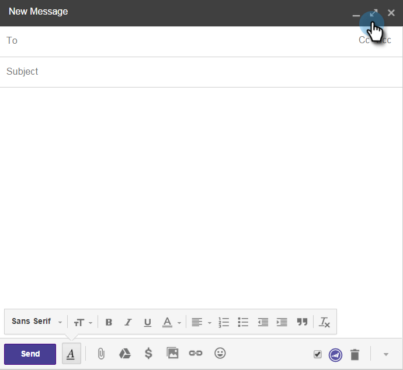
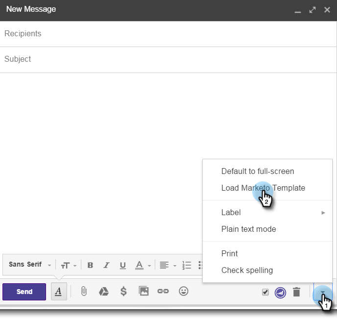
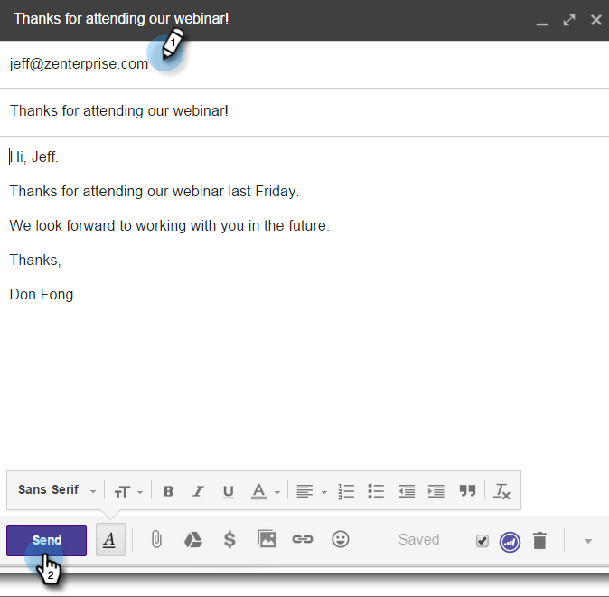
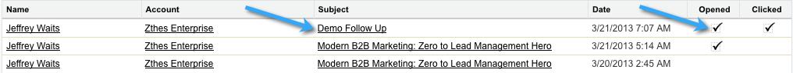
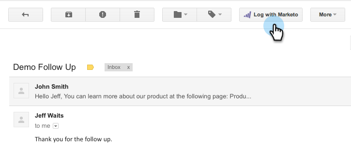
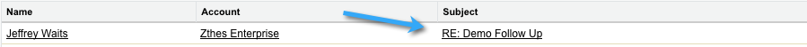

# Using Marketo Insights for Google Chrome {#using-marketo-insights-for-google-chrome}

Send and track any Google email with the Marketo Insights for Google Chrome. 

>[!NOTE]
>
>**Prerequisites**
>
>* [Install Marketo Insights for Google Chrome](install-marketo-insights-for-google-chrome.md)
>

## Send an Email with Marketo Insights {#send-an-email-with-marketo-insights}

1. From the Compose Window, click the Marketo icon.

   

1. The Send button has turned Marketo purple! This email now will be sent with Marketo, all links will be tracked, and a tracking pixel will be inserted into the email. This will be recorded as a Sent Sales Email activity.

   

   >[!NOTE]
   >
   >A tracking pixel lets you know who opened your email.

   >[!TIP]
   >
   >Optionally, click the double arrow to expand to a full screen view.

1. If you want to prefill your email with a published Marketo template, click **More Options **and select** Load Marketo Template.**

   

1. Select an **Available template** and click **Ok.**

   

1. Enter your content, an email address, and click **Send**.

   

   >[!NOTE]
   >
   >Messages are tracked only when the **Send** button is purple.

1. The email will soon appear in your Marketo Sales Insight and any opens and clicks are tracked.

   

## Log Email Replies with Marketo {#log-email-replies-with-marketo}

You can log replies and old activity in a lead's activity history.

1. From Google Mail's preview pane, click **Log with Marketo**.

   

1. That's all! The email will soon appear in Marketo Sales Insight.

   

   >[!NOTE]
   >
   >**Related Articles**
   >
   >    
   >    
   >    * [Install Marketo Insights for Google Chrome](install-marketo-insights-for-google-chrome.md) 
   >    * [View Person and Account Information and Activities in Google Mail](view-person-and-account-information-and-activities-in-google-mail.md)
   >    
   >

