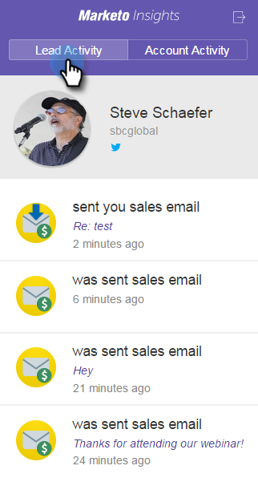
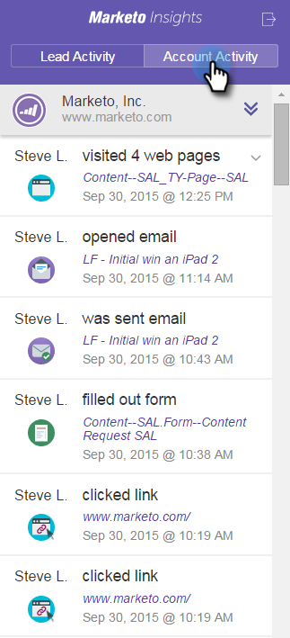

# View Person and Account Information and Activities in Google Mail {#view-person-and-account-information-and-activities-in-google-mail}

## View Activities in Google Mail {#view-activities-in-google-mail}

Use the contextual Marketo Insights pane to see account information and recent activities.

The pane appears in the normal Google Mail reading pane for Inbox and Sent items and shows information and activities for the person who sent you the email you're reading (or who you sent the email to for items in the Sent folder).

The Person Activity tab displays relevant information about the person, such as name, title, picture, and so on. You can also see the most recent activities that have occurred after you sent an email, such as visit a webpage, fill out a form, click a link, attend an event, and open an email.

The Account Activity tab, displays relevant account information, such as company name, website URL, and location. The tab also displays the most recent account activities. The account is identified by the person domain. Activities appear in the list if any Sales Insight user in your subscription has ever corresponded with them.

If your team has never exchanged a sales email with the person, no activities appear.

Click the icon to collapse the pane.

Click the Marketo icon to expand the pane.

## View Activities in [!DNL Google Chrome] {#view-activities-in-google-chrome}

You can also use the Global Activity Pane in [!DNL Google Chrome] to see a full list of the most recent activities that have occurred for all people that you've recently corresponded with. This is a real-time updated feed that continuously displays the number of unread activities on the icon.

Click the Marketo icon to open the pane.

>[!MORELIKETHIS]
>
>[Using Marketo Insights for [!DNL Google Chrome]](/help/marketo/product-docs/marketo-sales-insight/msi-chrome-plugin/using-marketo-insights-for-google-chrome.md)
