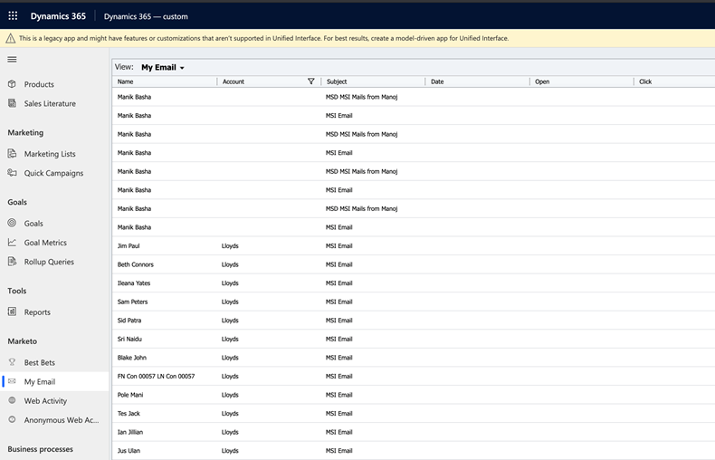

# Email Activities {#email-activities}

The Email Activities tab shows all Emails sent by Sales to the leads and contacts under the Sales owner. Review sent date and whether the email was opened or clicked by the recipient.

