# Install and Configure Marketo Sales Insight in Microsoft Dynamics 2011 {#install-and-configure-marketo-sales-insight-in-microsoft-dynamics}

Marketo Sales Insight is a fantastic tool for your sales team. Here is the step-by-step instruction of how to install and configure it in Microsoft Dynamics 2011 On-Premises.

>[!NOTE]
>
>**Prerequisites**
>
>Complete your [Marketo-Microsoft integration](http://docs.marketo.com/x/DoA2).
>
>[Download the correct solution](http://docs.marketo.com/x/LoJo) for your version of Microsoft Dynamics CRM.

## Import Solution {#import-solution}

1. Sign in to Microsoft Dynamics CRM. Click **Settings** in the bottom left menu.

   

1. Select **Solutions** in the tree.

   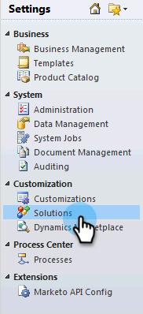

1. Click **Import** ( ).

   

   >[!NOTE]
   >
   >**Reminder**
   >
   >
   >You should already have [installed and configured](install-and-configure-marketo-sales-insight-in-microsoft-dynamics-2011.md) the Marketo solution before moving forward.

1. Click **Browse**. Select the Marketo Sales Insight solution you [downloaded](download-the-marketo-sales-insight-solution-for-microsoft-dynamics.md). Click **Next**.

   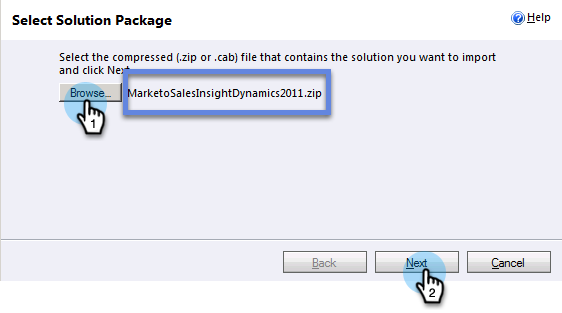

1. Verify the details of the solution, and click **Next**.

   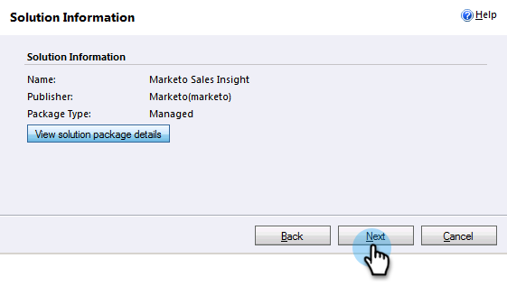

1. Make sure the SDK message option is checked. Click **Next**.

   

1. Now wait for the import to finish.

   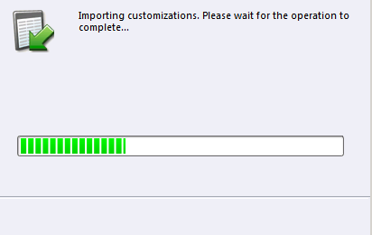

1. Click **Close**.

   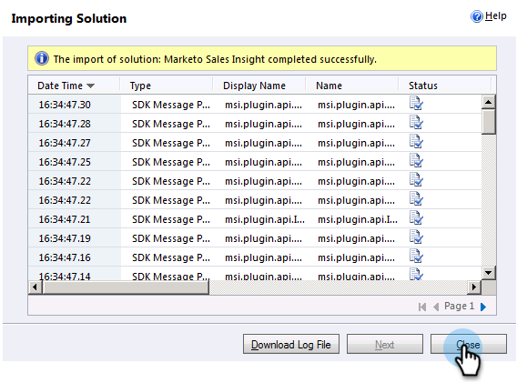

1. Marketo Sales Insight will now show up in the solution list. Yay!

   

1. Select Marketo Sales Insight and click on **Publish All Customizations** ( ).

   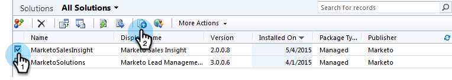

## Connect Marketo and Sales Insight  {#connect-marketo-and-sales-insight}

>[!NOTE]
>
>**Admin Permissions Required**

1. Log in to Marketo and click **Admin**.

   

1. Under the **Sales Insight **section click **Edit API Configuration**.

   

1. Copy the **Marketo Host**, **API URL**, and **API User Id** for use in a later step. Enter an **API Secret Key** of your choice and click **SAVE**.

   >[!CAUTION]
   >
   >Don't use an ampersand (&) in your API Secret Key.

   

   >[!NOTE]
   >
   >The following fields must be synced with Marketo for *both Lead and Contact* for Sales Insight to work:
   >
   >    
   >    
   >    * Priority 
   >    * Urgency
   >    * Relative Score
   >    
   >    
   >If any of these fields are missing, you will see an error message in Marketo with the name of the missing fields. To fix this, perform [this procedure](../../../../product-docs/marketo-sales-insight/msi-for-microsoft-dynamics/setting-up-and-using/required-fields-for-syncing-marketo-with-dynamics.md).

1. Go back to Dynamics, select **Settings**.

   

1. Select **Marketo API Config** in the tree.

   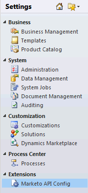

1. Click **Default Configuration**.

   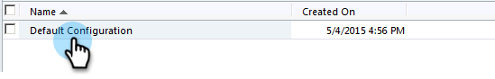

1. Enter the information you took from Marketo earlier.

   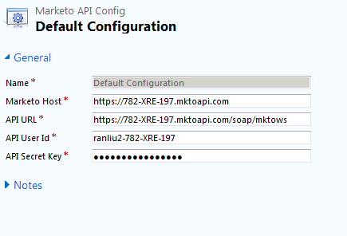

1. Click **Save.**

   ** 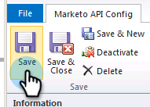

   **

## Set User Access {#set-user-access}

Set up user roles to give specific users access to Sales Insight.

1. Select **Settings**.

   

1. Select **Administration** in the tree.

   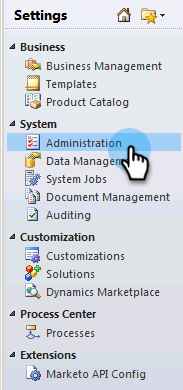

1. Click **Users**.

   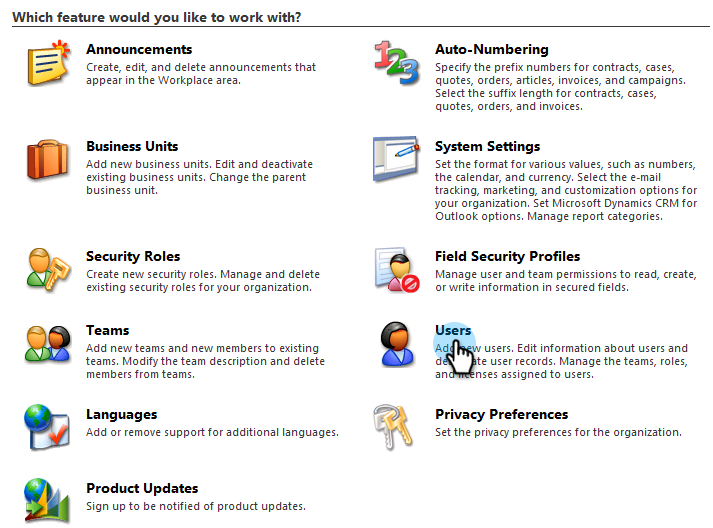

1. Select the user(s) you want to grant access to and click **Manage Roles**.

   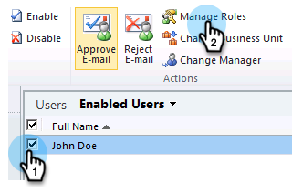

1. Select the **Marketo Sales Insight** role and click **OK**.

   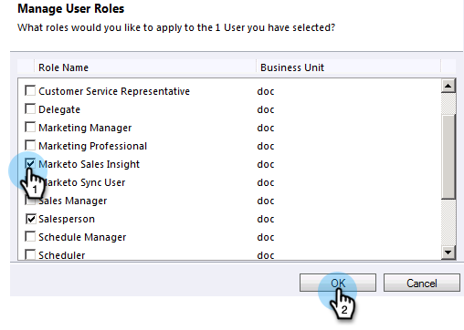

   And that's it! All the users have access will now be able to see the sales insight section in the lead/contact detail view.

   

   Congrats. You have now unleashed the power of Marketo Sales Insight.

>[!NOTE]
>
>**Related Articles**
>
>[Setting up Stars and Flames for Lead/Contact Records](http://docs.marketo.com/x/BICMAg)

