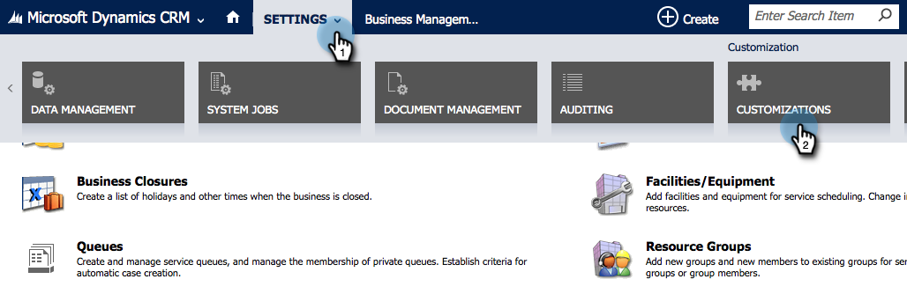
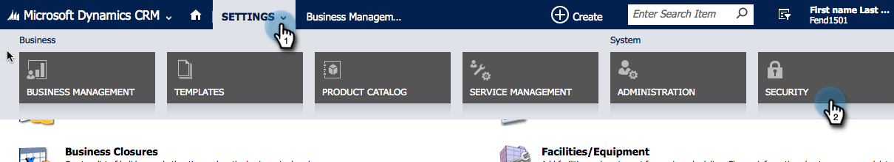

# Install and Configure [!DNL Marketo Sales Insight] in [!DNL Microsoft Dynamics 2015] {#install-and-configure-marketo-sales-insight-in-microsoft-dynamics}

Marketo Sales Insight is a fantastic tool for giving your sales team a "window" into the wealth of data the Marketing team has. Here is how to install and configure it in [!DNL Microsoft Dynamics 2015]

>[!PREREQUISITES]
>
>Complete your Marketo-Microsoft integration.
>
>[Download the correct solution](/help/marketo/product-docs/marketo-sales-insight/msi-for-microsoft-dynamics/installing/download-the-marketo-sales-insight-solution-for-microsoft-dynamics.md) for your version of [!DNL Microsoft Dynamics CRM].

## Import Solution {#import-solution}

OK, now it's time to import the [!DNL Marketo Sales Insight] solution into [!DNL Microsoft Dynamics]. Here's how:

1. Under [!UICONTROL Microsoft Dynamics CRM] click **[!UICONTROL Settings]**.

   

1. Under [!UICONTROL SETTINGS], click **[!UICONTROL Customizations]**.

   

1. Click **[!UICONTROL Solutions]**.

   

   >[!NOTE]
   >
   >You should already have installed and configured the Marketo solution before moving forward.

1. Click **[!UICONTROL Import]**.

   

1. In the new window, click **[!UICONTROL Browse]**.

   

1. Find and select the solution you downloaded above.

   

1. Click **[!UICONTROL Next]**.

   

1. The solution will upload. You can view the package contents if you like. Click **[!UICONTROL Next]**.

   

1. Make sure to leave the box checked and click **[!UICONTROL Import]**.

   

1. Feel free to download the log file, then click **[!UICONTROL Close]**.

   

1. Awesome! You should see the solution now. If it's not there, refresh your screen.

   

## Connect Marketo and Sales Insight {#connect-marketo-and-sales-insight}

Let's tie your Marketo instance to [!DNL Sales Insight] in [!DNL Dynamics]. Here's how:

>[!NOTE]
>
>Admin rights required.

1. Log into Marketo and go to the **[!UICONTROL Admin]** section.

   

1. Under the [!UICONTROL Sales Insight] section, click **[!UICONTROL Edit API Configuration]**.

   

1. Copy the **[!UICONTROL Marketo Host]**, **[!UICONTROL API URL]**, and **[!UICONTROL API User Id]** for use in a later step. Enter an API Secret Key of your choice and click **[!UICONTROL Save]**.

   >[!CAUTION]
   >
   >Don't use an ampersand (&) in your API Secret Key.

   

   >[!NOTE]
   >
   >The following fields must be synced with Marketo for *both Lead and Contact* for [!DNL Sales Insight] to work:
   >
   >* Priority
   >* Urgency
   >* Relative Score
   >
   >If any of these fields are missing, you will see an error message in Marketo with the name of the missing fields. To fix this, perform [this procedure](/help/marketo/product-docs/marketo-sales-insight/msi-for-microsoft-dynamics/setting-up-and-using/required-fields-for-syncing-marketo-with-dynamics.md).

1. Back in [!DNL Microsoft Dynamics], go to **[!UICONTROL Settings]**.

   

1. Under **[!UICONTROL Settings]**, click **[!UICONTROL Marketo API Config]**.

   

1. Click **[!UICONTROL New]**.

   

1. Enter the information that you took from Marketo earlier and click **[!UICONTROL Save]**.

   

## Set User Access {#set-user-access}

Finally, you have to give specific users access to use Marketo Sales Insight.

1. Go to **[!UICONTROL Settings]**.

   

1. Go to **[!UICONTROL Security]**.

   

1. Click **[!UICONTROL Users]**.

   

1. Select the users you want to give access to [!DNL Sales Insight] to and click **[!UICONTROL Manage Roles]**.

   

1. Select the [!DNL Marketo Sales Insight] role and click **[!UICONTROL OK]**.

   

   And you should be all done! Finally, to test, log into [!DNL Dynamics] as a user who has access to [!DNL Marketo Sales Insight] and look at a lead or contact.

   

You have now unlocked the power of [!DNL Marketo Sales Insight] for your sales team.

>[!MORELIKETHIS]
>
>[Setting up Stars and Flames for Lead/Contact Records](/help/marketo/product-docs/marketo-sales-insight/msi-for-microsoft-dynamics/setting-up-and-using/setting-up-stars-and-flames-for-lead-contact-records.md)
