# Install and Configure Marketo Sales Insight in Microsoft Dynamics 365 {#install-and-configure-marketo-sales-insight-in-microsoft-dynamics}

Marketo Sales Insight is a fantastic tool for giving your sales team a "window" into the wealth of data the Marketing team has. Here's how to install and configure.

>[!PREREQUISITES]
>
>Complete your [Marketo-Microsoft integration](http://docs.marketo.com/x/E4A2).
>
>[Download the correct solution](http://docs.marketo.com/x/LoJo) for your version of Microsoft Dynamics CRM.

## Import Solution {#import-solution}

1. Log in to [Microsoft Office 365](https://login.microsoftonline.com/).

   

1. Click the  menu and select **CRM**.

   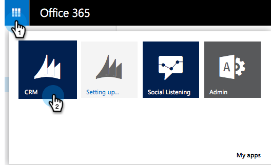

1. Click the  menu. In the drop-down, select **Settings**, then select **Solutions**.

   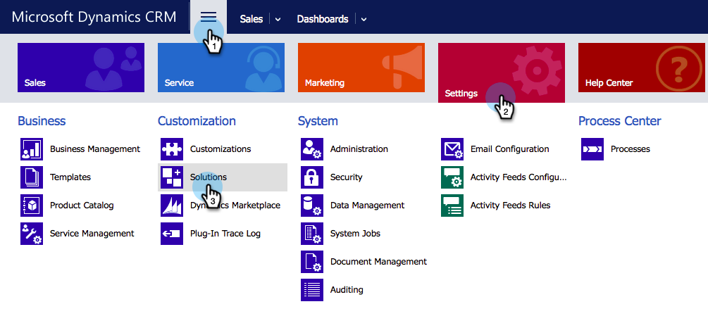

   >[!NOTE]
   >
   >**Reminder**
   >
   >
   >You should already have [installed and configured the Marketo solution](../../../../product-docs/crm-sync/microsoft-dynamics-sync/sync-setup/microsoft-dynamics-365/step-1-of-3-install.md) before moving forward.

   Click Import.
   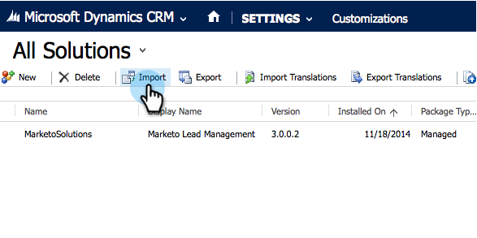

1. In the new window, click **Browse**. Choose the [Marketo Sales Insight solution you downloaded in step 1](#msi). Click **Next**.

   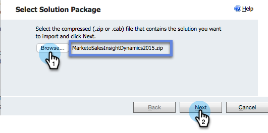

1. The solution will upload. You can view the package contents if you like. Click **Next**.

   

1. Make sure to leave the box **checked** and click **Import**.

   

1. Feel free to download the log file. Click **Close**.

   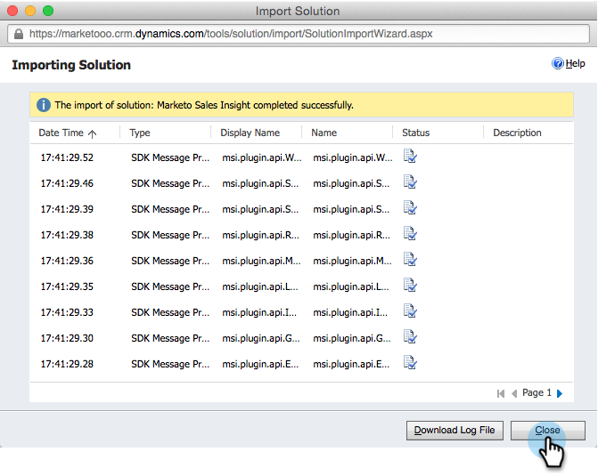

1. Awesome! You should see the solution now. If it's not there, refresh your screen.

   

1. Click **Publish All Customizations**.

   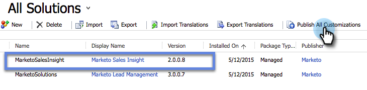

## Connect Marketo and Sales Insight {#connect-marketo-and-sales-insight}

Let's tie your Marketo instance to Sales Insight in Dynamics. Here is how:

>[!NOTE]
>
>**Admin Permissions Required**

1. Log into Marketo and go to the **Admin** section.

   

1. Under the **Sales Insight** section, click **Edit API Configuration**.

   

1. Copy the **Marketo Host**, **API URL** and **API User Id** for use in a later step. Enter an **API Secret Key** of your choice and click **SAVE**.

   >[!CAUTION]
   >
   >Don't use an ampersand (&) in your API Secret Key.

   

   >[!NOTE]
   >
   >The following fields must be synced with Marketo for *both Lead and Contact* for Sales Insight to work:
   >
   > * Priority
   > * Urgency
   > * Relative Score
   >
   >If any of these fields are missing, you will see an error message in Marketo with the name of the missing fields. To fix this, perform [this procedure](../../../../product-docs/marketo-sales-insight/msi-for-microsoft-dynamics/setting-up-and-using/required-fields-for-syncing-marketo-with-dynamics.md).

1. Back in Microsoft Dynamics, click the  icon next to Settings, then select **Marketo API Config** in the dropdown.

   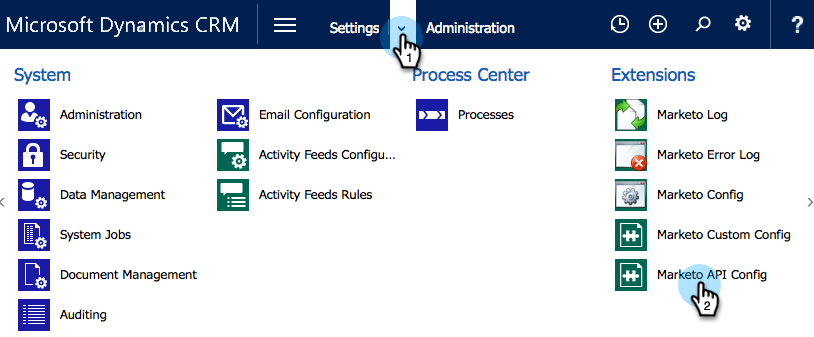

1. Click **Default Configuration**.

   

1. Enter the information that you copied from Marketo earlier.

   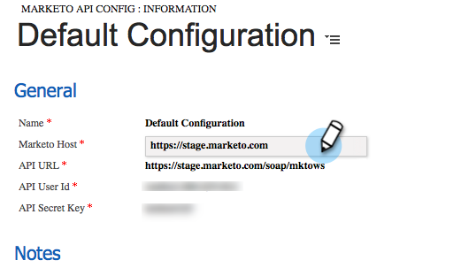

1. Click the  icon in the bottom right corner to save the changes.

## Set User Access {#set-user-access}

You need to give users permissions to use Sales Insight.

1. Click the  menu. In the dropdown menu select **Settings**, then select **Security**.

   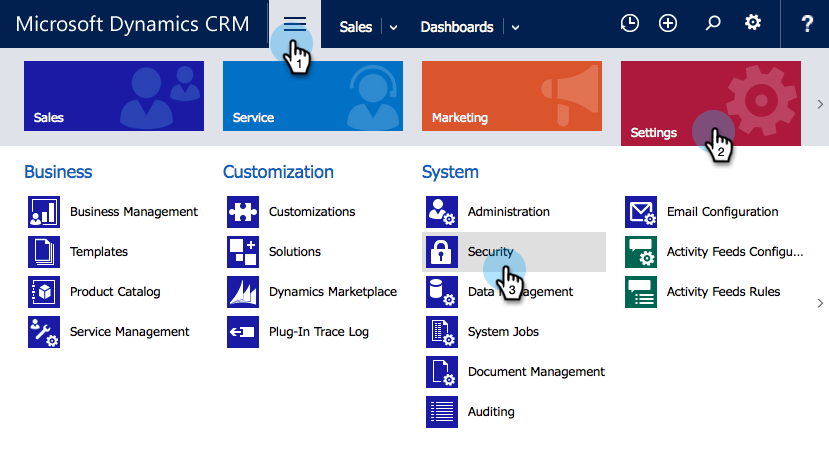

1. Click **Users**.

   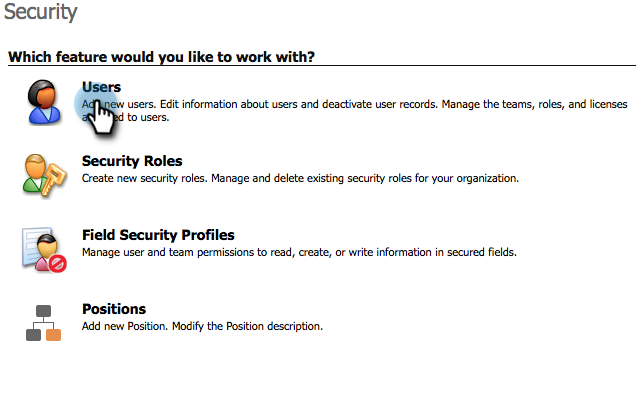

1. Select the user(s) you want to give access to Sales Insight to and click **Manage Roles**.

   

1. Select the **Marketo Sales Insight** role and click **OK**.

   

   And you should be all done! Finally, to test, log into Dynamics as a user who has access to Marketo Sales Insight and look at a lead or contact.

   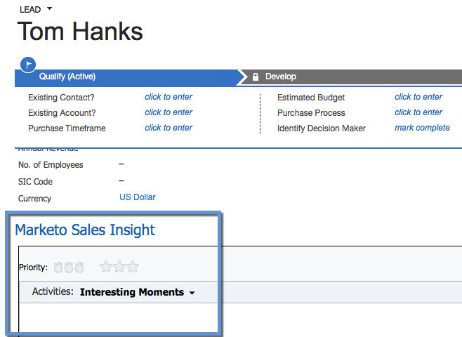

You have now unlocked the power of Marketo Sales Insight for your sales team.

>[!MORELIKETHIS]
>
>[Setting up Stars and Flames for Lead/Contact Records](http://docs.marketo.com/x/BICMAg)