# Install and Configure Marketo Sales Insight in Microsoft Dynamics Online {#install-and-configure-marketo-sales-insight-in-microsoft-dynamics-online}

Install and Configure Marketo Sales Insight in Microsoft Dynamics Online - Marketo Docs - Product Documentation

Marketo Sales Insight is a fantastic tool for giving your sales team a "window" into the wealth of data the Marketing team has. Here's how to install and configure it in Microsoft Dynamics Online.

>[!NOTE]
>
>**Prerequisites**
>
>Complete your [Marketo-Microsoft integration](http://docs.marketo.com/x/E4A2).
>
>[Download the correct solution](http://docs.marketo.com/x/LoJo) for your version of Microsoft Dynamics CRM.

### What's in this article? {#whats-in-this-article}

[Import Solution](#import-solution)  
[Connect Marketo and Sales Insight](#connect-marketo-and-sales-insight)  
[Enable Sync](#enable-sync)  
[Set User Access](#set-user-access)

#### Import Solution {#import-solution}

>[!NOTE]
>
>If you're using the Unified Interface, prior to Step 1 below, click the Settings icon in the top-right corner and select **Advanced Settings**.

1. Under Microsoft Dynamics CRM click **Settings**.

   

1. Under SETTINGS, click **Customizations**.

   

1. Click **Solutions**.

   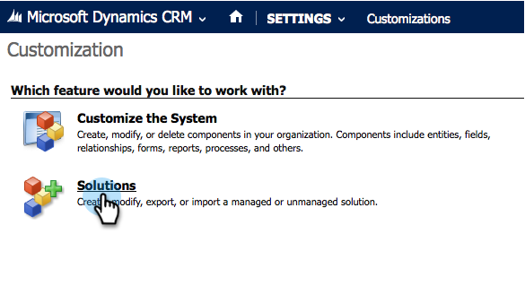

   >[!NOTE]
   >
   >**Reminder**
   >
   >
   >You should already have installed and configured the Marketo solution before moving forward.

1. Click **Import**.

   

1. In the new window, click **Browse**.

   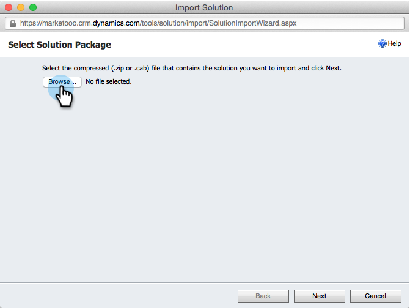

1. On your computer, find and install the solution you just downloaded.
1. Click **Next**.

   

1. The solution will upload. You can view the package contents if you like. Click **Next**.

   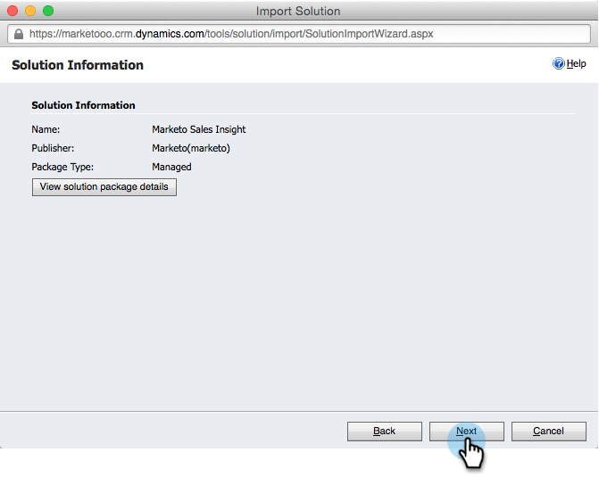

1. Make sure to leave the box checked and click **Import**.

   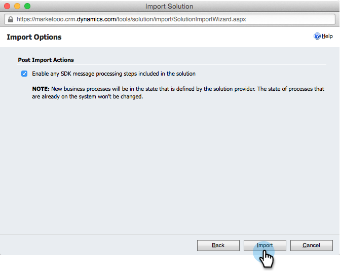

1. Feel free to download the log file, then click **Close**.

   

1. Awesome! You should see the solution now. If it's not there, refresh your screen.

   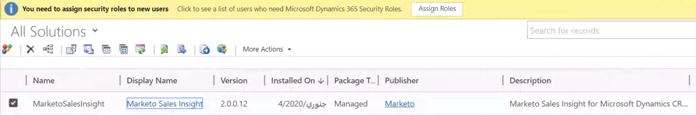

1. Click **Publish Customization**.

   >[!NOTE]
   >
   >Make sure to enable the Global MS Dynamics sync.

#### Connect Marketo and Sales Insight {#connect-marketo-and-sales-insight}

Let's tie your Marketo instance to Sales Insight in Dynamics. Here's how:

>[!NOTE]
>
>**Admin Permissions Required**

1. Log-in Marketo and go to the **Admin **section.

   

1. Under the Sales Insight section, click **Edit API Configuration**.

   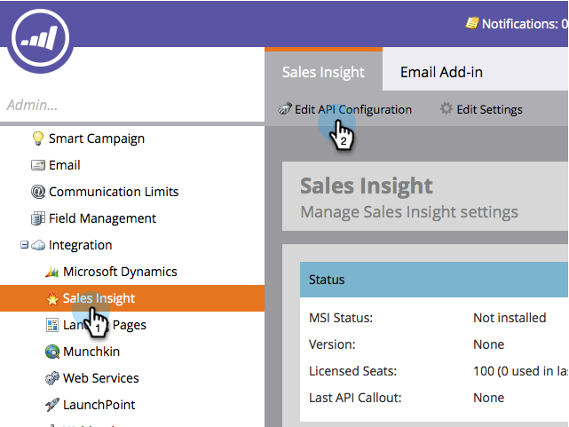

1. Copy the **Marketo Host**, **API URL**, and **API User Id** for use in a later step. Enter an API Secret Key of your choice and click **Save**.

   >[!CAUTION]
   >
   >Don't use an ampersand (&) in your API Secret Key.

   

   >[!NOTE]
   >
   >The following fields must be synced with Marketo for *both Lead and Contact* for Sales Insight to work:
   >
   >    
   >    
   >    * Priority 
   >    * Urgency
   >    * Relative Score
   >    
   >    
   >If any of these fields are missing, you will see an error message in Marketo with the name of the missing fields. To fix this, perform [this procedure](../../../../product-docs/marketo-sales-insight/msi-for-microsoft-dynamics/setting-up-and-using/required-fields-for-syncing-marketo-with-dynamics.md).

1. Back in Microsoft Dynamics, go to **Settings**.

   

1. Under **Settings**, click **Marketo API Config**.

   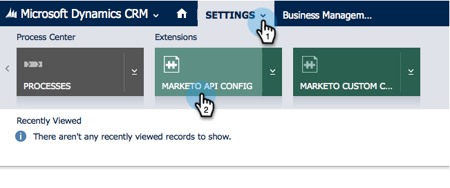

1. Click **New**.

   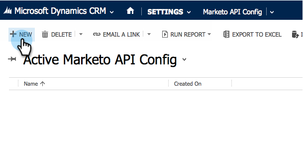

1. Enter the information that you took from Marketo earlier and click **Save**.

   

#### Enable Sync {#enable-sync}

1. In Marketo, click **Admin**.

   

1. Under Integration, select **Microsoft Dynamics**.

   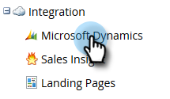

1. Click **Enable Sync**.

   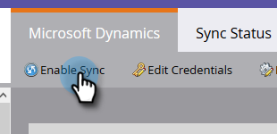

1. Click **Edit** next to Field Sync Details.

   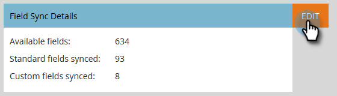

1. This will *automatically* select MSI fields that were previously disabled (Urgency, Relative Score, and Priority). Simply click **Save** to to start syncing data.

   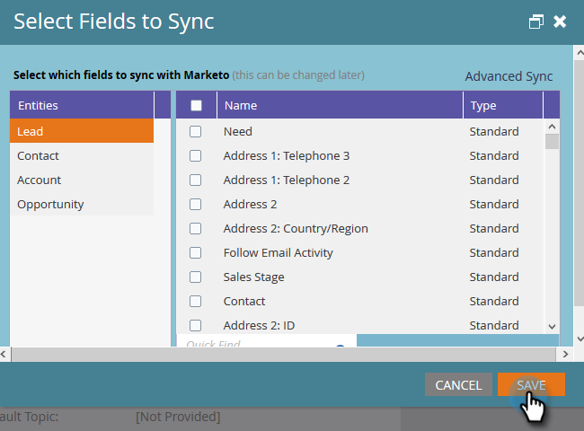

#### Set User Access {#set-user-access}

Finally, you have to give specific users access to use Marketo Sales Insight.

1. Go to **Settings**.

   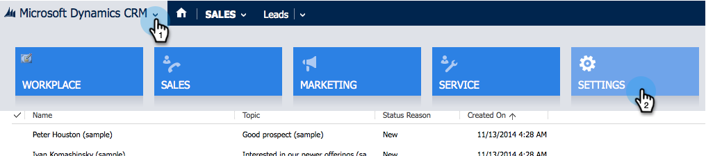

1. Go to **Security**.

   

1. Click **Users**.

   

1. Select the users you want to give access to Sales Insight to and click **Manage Roles**.

   

1. Select the Marketo Sales Insight role and click **OK**.

   

   And you should be all done! Finally, to test, log into Dynamics as a user who has access to Marketo Sales Insight and look at a lead or contact.

   

>[!NOTE]
>
>**Related Articles**
>
>[Setting up Stars and Flames for Lead/Contact Records](http://docs.marketo.com/x/BICMAg)

