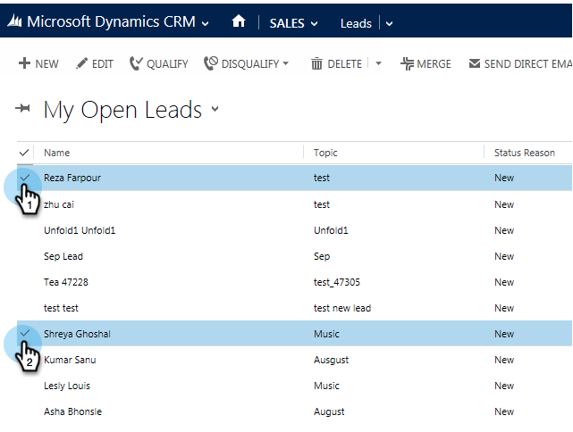
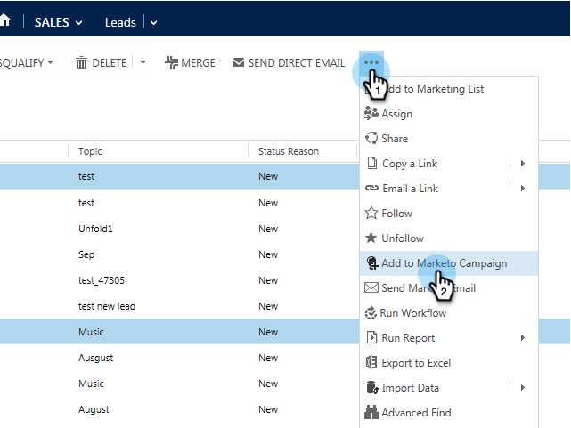
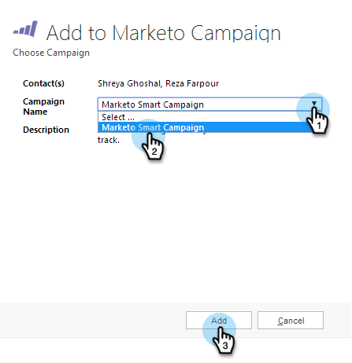

# Add a Lead/Contact to a Marketo Campaign from Microsoft Dynamics {#add-a-lead-contact-to-a-marketo-campaign-from-microsoft-dynamics}

You can quickly and easily add leads/contacts to Marketo smart campaigns directly from within Microsoft Dynamics. Here's how.

1. In Dynamics, go to the **Sales** area.

   

1. Select a view.

   

1. Select one or more leads or contacts.

   

1. Click** ...** and select **Add to Marketo Campaign**.

   

1. Select the Marketo campaign you want to add the leads or contacts to and click **Add**.

   

   >[!NOTE]
   >
   >For the campaign to appear in the drop-down, use the  [**Campaign is Requested** trigger](http://docs.marketo.com/pages/viewpage.action?pageId=7514898), with Sales Insight as the source, when you set up the campaign.

And that's all folks! You now have the power of Marketo smart campaigns in your hands directly from Dynamics.
