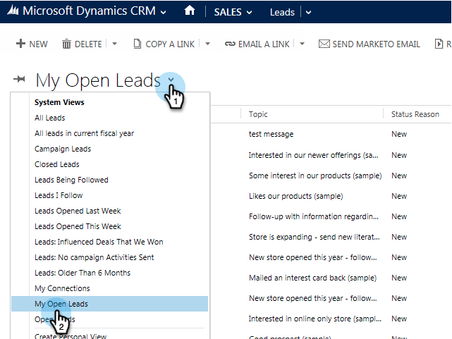

# Add a Lead/Contact to a Marketo Campaign from [!DNL Microsoft Dynamics] {#add-a-lead-contact-to-a-marketo-campaign-from-microsoft-dynamics}

You can quickly and easily add leads/contacts to Marketo smart campaigns directly from within [!DNL Microsoft Dynamics]. Here's how.

1. In [!DNL Dynamics], go to the **[!UICONTROL Sales]** area.

   

1. Select a view.

   

1. Select one or more leads or contacts.

   

1. Click **...** and select **[!UICONTROL Add to Marketo Campaign]**.

   

1. Select the Marketo campaign you want to add the leads or contacts to and click **[!UICONTROL Add]**.

   

   >[!NOTE]
   >
   >For the campaign to appear in the drop-down, use the  [**Campaign is Requested** trigger](/help/marketo/product-docs/core-marketo-concepts/smart-campaigns/using-smart-campaigns/setting-up-a-trigger-smart-campaign-for-sales-using-campaign-is-requested.md), with [!DNL Sales Insight] as the source, when you set up the campaign.

And that's all folks! You now have the power of Marketo smart campaigns in your hands directly from [!DNL Dynamics].
