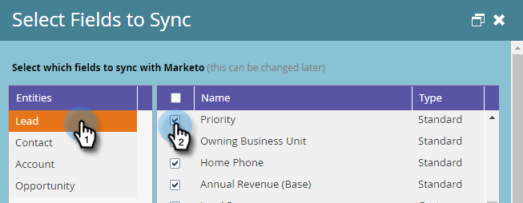
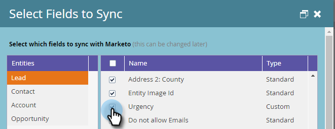
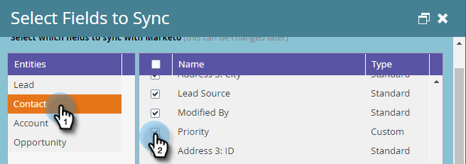

# Required Fields for Syncing Marketo with Dynamics {#required-fields-for-syncing-marketo-with-dynamics}

These fields *must* be synced with Marketo for both Lead and for Contact for Sales Insight to work:

* Priority 
* Urgency 
* Relative Score

If any of these fields are missing, you will see an error message in Marketo with the name of the missing fields. To fix this, check in your instance to be sure the fields are synced for both **Lead** and **Contact**. If not, add them.

Here's how to verify and add sync fields.

##### 1. Go to Admin and click Microsoft Dynamics. {#go-to-admin-and-click-microsoft-dynamics}

##### 2. Click Edit on Field Sync Details. {#click-edit-on-field-sync-details}

##### 3. Under Lead, check the Priority checkbox. {#under-lead-check-the-priority-checkbox}

##### 4. Now, scroll down and check the Urgency checkbox... {#now-scroll-down-and-check-the-urgency-checkbox}

##### 5. ...and the Relative Score checkbox. {#and-the-relative-score-checkbox}

##### 6. Next, check the checkboxes for Priority, Urgency, and Relative Score for Contact. {#next-check-the-checkboxes-for-priority-urgency-and-relative-score-for-contact}

##### 7. Click Save. {#click-save}

>[!NOTE]
>
>Be sure to wait at least 10 minutes for a sync to run before verifying that you've fixed the issue.

>[!NOTE]
>
>**Related Articles**
>
>[Setting up Stars and Flames for Lead/Contact Records](http://docs.marketo.com/x/BICMAg)

