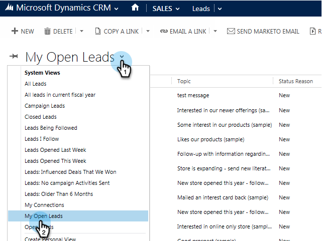
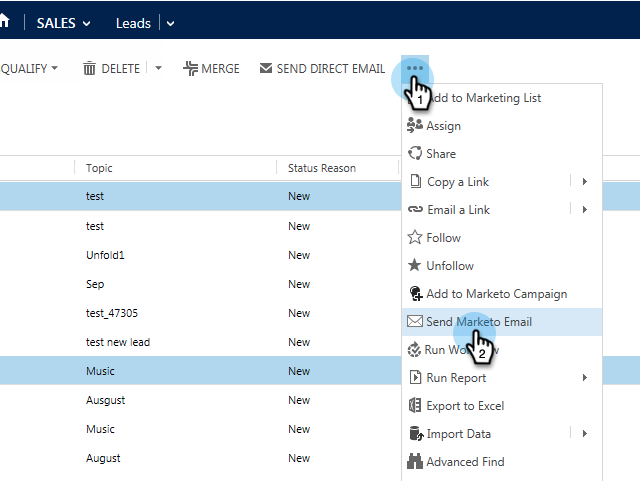

# Send a Marketo Sales Email from Microsoft Dynamics {#send-a-marketo-sales-email-from-microsoft-dynamics}

Your sales team can send emails and have them tracked for opens and clicks directly from within Microsoft Dynamics. Here's how.

1. In Dynamics, go to the **Sales** area.

   

1. Select a **System View**.

   

1. Select one or more leads.

   

1. Click the **...** tab, then click **Send Marketo Email**.

   

   >[!TIP]
   >
   >You can [publish emails as templates](/help/marketo/product-docs/marketo-sales-insight/msi-for-salesforce/features/actions-in-the-msi-panel/send-marketo-email/publish-an-email-to-sales-insight.md) for your sales team to use.

1. Add a subject, compose your email and click **Send Email**. (Pick a template if you need one.)

   

   You can click **Send Test Email** first and the email will be sent to you (primary email address in Microsoft Dynamics) before sending the actual email.

Nicely done! Now you know how to send Marketo tracked emails directly from within Microsoft Dynamics.

>[!MORELIKETHIS]
>
>[Add a Lead/Contact to a Marketo Campaign from Microsoft Dynamics](/help/marketo/product-docs/marketo-sales-insight/msi-for-microsoft-dynamics/setting-up-and-using/add-a-lead-contact-to-a-marketo-campaign-from-microsoft-dynamics.md)
