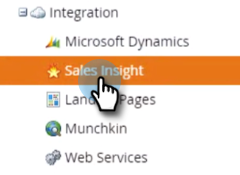

# Uninstall MSI from your MS Dynamics Instance {#uninstall-msi-from-your-ms-dynamics-instance}

To uninstall MSI from your MS Dynamics instance, you'll need to perform steps in both Marketo and MS Dynamics.

>[!NOTE]
>
>**Prerequisites**
>
>[Disable Global MS Dynamics Sync](http://docs.marketo.com/x/TAA6Ag)

1. In Marketo, click **Admin**.

   

1. Click **Sales Insight**.

   

1. Click **Edit Field Sync**.

   

1. Select the **Disable Sync** checkbox and click **Save**.

   >[!NOTE]
   >
   >**Reminder**
   >
   >
   >Make sure you [disable the Global MS Dynamics Sync](http://docs.marketo.com/x/TAA6Ag) prior to disabling the field sync.

   

## The following steps take place in your MS Dynamics instance: {#the-following-steps-take-place-in-your-ms-dynamics-instance}

1. Click **Advanced Settings**.
1. Click **Solutions**.
1. Select **Marketo Sales Insight** and click the delete icon.
1. When the Uninstall Solution modal pops up, click **OK**.

   It usually takes about 20 minutes for MS Dynamics solution to fully uninstall. However, if you have a large MS Dynamics instance, it could take a bit longer.

   >[!NOTE]
   >
   >**Reminder**
   >
   >
   >Remember to turn on the Global MS Dynamics sync once you uninstall MSI.

