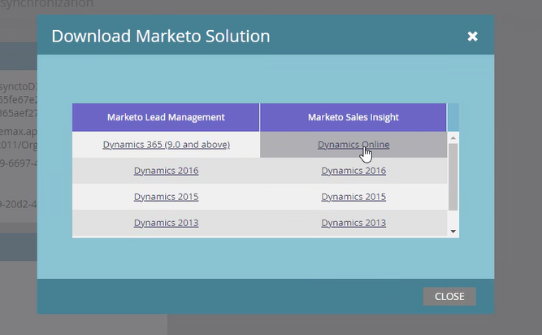
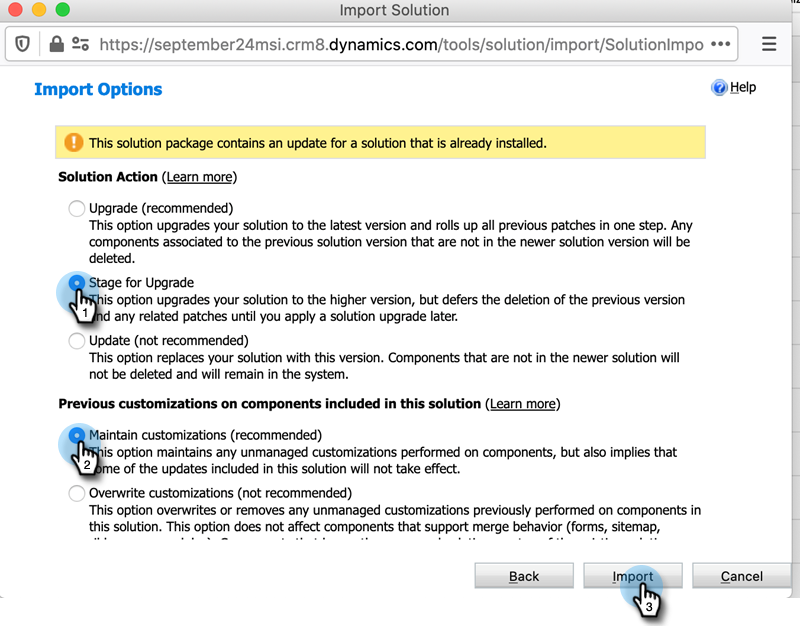

# Upgrade the [!DNL Marketo Sales Insight] Solution for [!DNL Microsoft Dynamics] {#upgrade-the-marketo-sales-insight-solution-for-microsoft-dynamics}

When a new [!DNL Microsoft Dynamics] solutions is released for [!DNL Sales Insight], you can download the Upgrade from the [!UICONTROL Admin] area in your account.

>[!NOTE]
>
>**Admin Permissions Required**

1. Go to the **[!UICONTROL Admin]** area.

   

1. Click **[!UICONTROL Microsoft Dynamics]**.

   

1. Select **[!UICONTROL Download Marketo Solution]**.

   

1. Select the appropriate solution for your [!DNL Microsoft Dynamics] version.

   

   Awesome! A zip file of the solution will now be downloaded to your device.

## Performing the Upgrade {#performing-the-upgrade}

1. Import the latest version of the solution over the existing version of your [!DNL Dynamics CRM] (ex: if your [!DNL Dynamics CRM] has version 1.4 and the latest version is 1.5, you would import _over_ version 1.4).

2. You will see the following pop-up. Select **[!UICONTROL Stage for Upgrade]** and **[!UICONTROL Maintain customizations]**, then click **[!UICONTROL Import]**.

