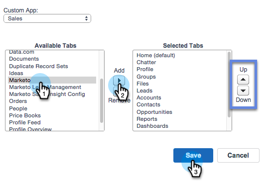
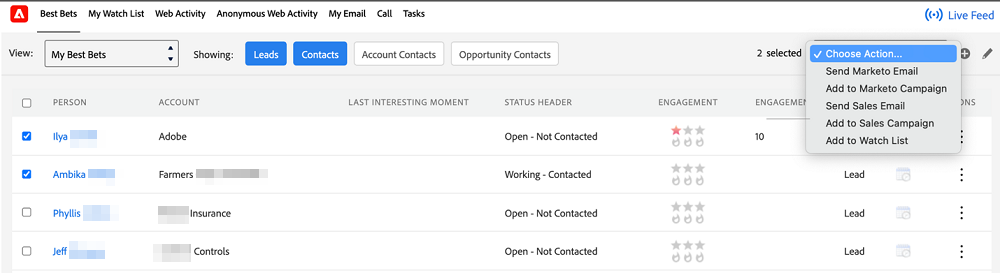

# Add Marketo Tab to Salesforce {#add-marketo-tab-to-salesforce}

1. In Salesforce, click **+** and click **Customize My Tabs**.

   

1. Select Marketo in the left list. Then click **Add** to add it to the **Selected Tabs**.

   >[!TIP]
   >
   >Use the **Up** and **Down** arrow to reorder your tabs.

   

   And here is your Marketo tab!

   
