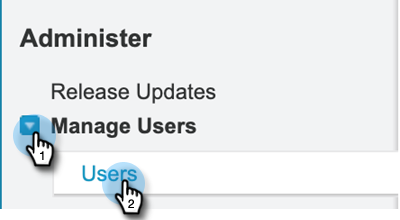
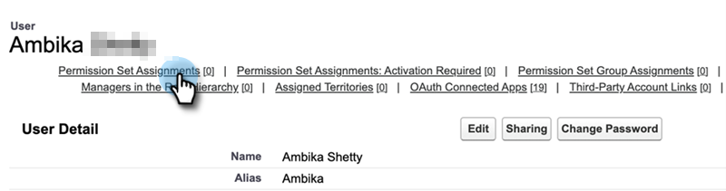
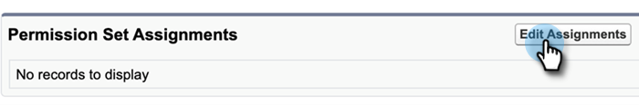
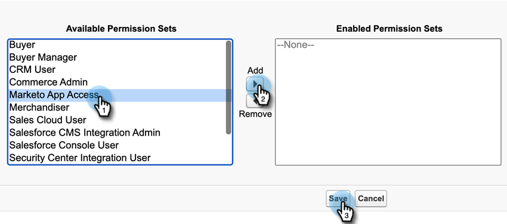
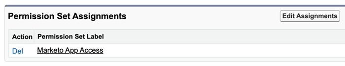

# Add [!DNL Sales Insight] Permission Set {#add-sales-insight-permission-set}

Use the following steps to add access to [!DNL Sales Insight] features in [!DNL Salesforce]. Applicable to [!DNL Salesforce] Classic and Lightening 

>[!PREREQUISITES]
>
>[Update your [!DNL Sales Insight] [!DNL Salesforce] package](/help/marketo/product-docs/marketo-sales-insight/msi-for-salesforce/upgrading/upgrading-your-msi-package.md){target="_blank"} to version 1.8000 or higher to use this feature.  

>[!IMPORTANT]
>
>If you’ve previously given [!DNL Sales Insight] access to all profiles and/or implemented [!DNL Sales Insight] for all your users, you must [remove profile level access](/help/marketo/product-docs/marketo-sales-insight/msi-for-salesforce/configuration/remove-sales-insight-access.md){target="_blank"} to use this permission set.

## Overview {#overview}

“Marketo App” permission is a part of the [!DNL Sales Insight] [!DNL Salesforce] package. It includes access to the below mentioned objects, apex classes, and visualforce pages. These are required to access all [!DNL Sales Insight] features.  

**Object Settings**

<table> 
 <tbody> 
 <tr> 
   <td>BestBetsCache</td> 
   <td>Read, Create, Edit, Delete, View All, Modify All</td> 
  </tr> 
  <tr> 
   <td>Best Bets View Details</td> 
   <td>Read, Create, Edit, Delete, View All, Modify All</td> 
  </tr> 
  <tr> 
   <td>Best Bets Views</td> 
   <td>Read, Create, Edit, Delete, View All, Modify All</td> 
  </tr> 
  <tr> 
   <td>EmailActivityCache</td> 
   <td>Read, Create, Edit, Delete, View All, Modify All</td> 
  </tr> 
  <tr> 
   <td>GetMethodArgus</td> 
   <td>Read, Create, Edit, Delete, View All, Modify All</td> 
  </tr> 
  <tr> 
   <td>GroupedWebActivityCache</td> 
   <td>Read, Create, Edit, Delete, View All, Modify All</td> 
  </tr> 
  <tr> 
   <td>InterestingMomentsCache</td> 
   <td>Read, Create, Edit, Delete, View All, Modify All</td> 
  </tr> 
  <tr> 
   <td>Marketo [!DNL Sales Insight] Config</td> 
   <td>Read, Create, Edit, Delete, View All, Modify All</td> 
  </tr> 
  <tr> 
   <td>ScoringCache</td> 
   <td>Read, Create, Edit, Delete, View All, Modify All</td> 
  </tr> 
  <tr> 
   <td>Values</td> 
   <td>Read, Create, Edit, Delete, View All, Modify All</td> 
  </tr> 
  <tr> 
   <td>WebActivityCache</td> 
   <td>Read, Create, Edit, Delete, View All, Modify All</td> 
  </tr> 
 </tbody> 
</table>

* Apex Class Access: 159 Apex Classes that begin with “mkto_si”
* Visualforce Page Access: 64 Visualforce Pages that begin with “mkto_si”
* Custom Setting Definitions: mkto_si.Marketo Settings & mkto_si.User Preferences

## Adding Marketo App Permission Set to Users {#adding-marketo-app-permission-set-to-users}

1. Log in to your [!DNL Salesforce] account.

1. Click **[!UICONTROL Setup]**.

   

1. Under Administrator, click to unfurl **[!UICONTROL Manage Users]**, then **[!UICONTROL Users]**.

   

1. Under All Users, select the user you want to provide access to, then click **[!UICONTROL Permission Set Assignments]**.

   

1. Click **[!UICONTROL Edit Assignments]**.

   

1. Select **[!UICONTROL Marketo App Access]** from the available permission sets, then **[!UICONTROL Add]**. Click **[!UICONTROL Save]**.

   

1. Now when you scroll down the User Detail page you will see “Marketo App Access” under Permission Set Assignments.

   

>[!NOTE]
>
>Users who don't have access to [!DNL Sales Insight] will see this message: “You do not have sufficient privileges to access this tab.”

That’s it! You’ve successfully added [!DNL Sales Insight] access. Repeat the same steps for any other profile you’d like to add access for.
