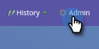
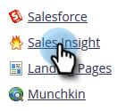
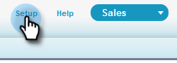
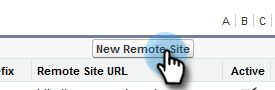
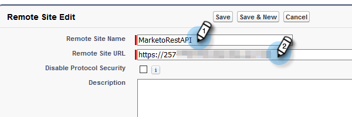
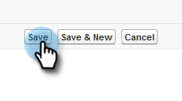
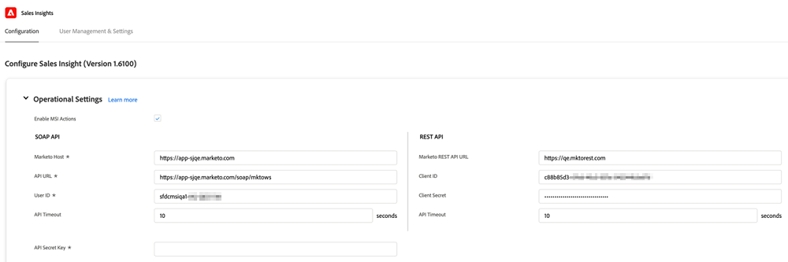

# Configuration for Existing Customers {#configuration-for-existing-customers}

Please set up the following configuration in order to begin using the new Insights Dashboard.

>[!PREREQUISITES]
>
>Please make sure you have upgraded your [!DNL Salesforce] package to the latest version

## Configure [!DNL Sales Insight] in Marketo {#configure-sales-insight-in-marketo}

1. Open a new tab in your browser to get the [!DNL Marketo Sales Insights] credentials from your Marketo account.

1. Go to the **[!UICONTROL Admin]** area.

   

1. Click **[!UICONTROL Sales Insight]**.

   

1. Click **[!UICONTROL View]** to populate Rest API credentials.

   

1. You'll see a confirmation pop-up. Click **[!UICONTROL OK]**.

## Configure [!DNL Sales Insight] in [!DNL Salesforce] {#configure-sales-insight-in-salesforce}

1. In Salesforce, click **[!UICONTROL Setup]**.

   

1. Search for and select **[!UICONTROL Remote Site Settings]**.

   

1. Click **[!UICONTROL New Remote Site]**.

   

1. Enter the [!UICONTROL Remote Site Name] (it can be something like “MarketoRestAPI”), and the [!UICONTROL Remote Site URL] (your API URL from Rest API Configuration panel in Marketo).

   

1. Click **[!UICONTROL Save]**.

   

   You have now created remote site setting for Rest API.

## Access Marketo Sales Insight {#access-marketo-sales-insight}

1. Copy the credentials from the Rest API panel in [!DNL Marketo’s Sales Insight] Admin page. Paste them in the Rest API section in Salesforce’s [!DNL Sales Insight] Configuration page.

1. Enter the [!UICONTROL API Secret Key].

   
