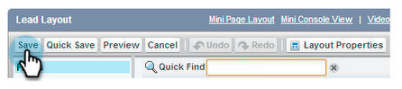

# Configure Marketo Sales Insight at Salesforce Enterprise/Unlimited {#configure-marketo-sales-insight-in-salesforce-enterprise-unlimited}

Configure Marketo Sales Insight in Salesforce Enterprise/Unlimited editions by completing the following steps.

>[!PREREQUISITES]
>
>[Install Marketo Sales Insight Package in Salesforce AppExchange](/help/marketo/product-docs/marketo-sales-insight/msi-for-salesforce/installation/install-marketo-sales-insight-package-in-salesforce-appexchange.md)

>[!NOTE]
>
>**Admin permissions are required.**

## Configure Sales Insight in Marketo Engage {#configure-sales-insight-in-marketo}

1. To obtain your Marketo Sales Insight credentials in Marketo Engage, go to the **[!UICONTROL Admin]** area and select **[!UICONTROL Sales Insight]**.

   

1. Click **[!UICONTROL Edit API Configuration]**.

   

1. Enter an API Secret Key of your choosing and click **Save**. Do NOT use an ampersand (`&`) in your API secret key.

   

   >[!NOTE]
   >
   >Your API secret key is like a password for your organization and should be secure.

1. To populate the credentials, click **[!UICONTROL View]** in the _[!UICONTROL Rest API Configuration]_ panel.

   

1. When you see a confirmation dialog, click **OK**.

   

   >[!TIP]
   >
   >Keep this window open. You need this information later for Salesforce configuration.

## Configure Sales Insight in Salesforce {#configure-sales-insight-in-salesforce}

1. From Salesforce, click **[!UICONTROL Setup]**.

   

1. Search for "remote site" and select **[!UICONTROL Remote Site Settings]**.

   

1. Click **[!UICONTROL New Remote Site]**.

   

1. Enter the Remote Site Name (it can be something similar to `MarketoSoapAPI`). Enter the Remote Site URL, which is your Marketo Host URL from the _[!UICONTROL Soap API Configuration]_ panel in Marketo Engage. Click **[!UICONTROL Save]**. You have now created remote site settings for Soap API.

   

1. Click **[!UICONTROL New Remote Site]** again.

   

1. Enter the Remote Site Name (it can be something similar to `MarketoAPI`). Enter the Remote Site URL, which is your API URL from _[!UICONTROL Rest API Configuration]_ panel in Marketo Engage. Click **[!UICONTROL Save]**. You have now created remote site settings for Rest API.

   >[!NOTE]
   >
   >_You_ choose your **[!UICONTROL Remote Site Name]** (`MarketoAPI` is used here). The **[!UICONTROL Remote Site URL]** can be found in the Marketo Host field of your Edit API Configuration dialog from Step 3 in the "Configure Sales Insight in Marketo" section.

## Grant Sales Insight users profile access to standard Salesforce objects {#grant-sales-insight-users-profile-access}

Due to Salesforce security enhancements, AppExchange packages can no longer grant permission to standard objects, and access must be granted to the relevant Salesforce objects from the Salesforce user's profile. To grant the required permissions, follow these steps. 

1. Click **[!UICONTROL Setup]**.

1. Search "Profiles" in Quick find.

1. Click **[!UICONTROL Edit]** next to the profile that your Salesforce users are using.

1. Under the _[!UICONTROL Standard Object Permission]_ section, enable **[!UICONTROL Read]** access for the following objects: [!UICONTROL Lead], [!UICONTROL Contact], [!UICONTROL Account], and [!UICONTROL Opportunity].

1. Click **[!UICONTROL Save]**.

## Customize page layouts {#customize-page-layouts}

1. Click **[!UICONTROL Setup]**.

   

1. Search for "page layout" and select the **[!UICONTROL Page Layout]** under **[!UICONTROL Leads]**.

   

1. Click **[!UICONTROL Visualforce Pages]** on the left. Drag **[!UICONTROL Section]** to the layout underneath the _[!UICONTROL Custom Links]_ section.
  
   

1. Enter "Marketo Sales Insight" as the **[!UICONTROL Section Name]**, select **[!UICONTROL 1-Column]**, and click **[!UICONTROL OK]**.

   

1. Drag and drop **[!UICONTROL Lead]** into the new section.

   

   >[!TIP]
   >
   >The name of this box changes based on the object type. For example, if you are modifying the page layout for Contacts, it displays Contact.

1. Double-click the **[!UICONTROL Lead]** block that you just added.
  
   

1. Edit height to **450** pixels and click **[!UICONTROL OK]**.

   

   >[!NOTE]
   >
   >Check **[!UICONTROL Show scrollbars]** if you need access to scroll-through activities.

   >[!TIP]
   >
   >The recommended height for the Accounts and Opportunities objects is 410 pixels.

1. Click **[!UICONTROL Fields]** on the left. Then search and drag the **[!UICONTROL Urgency]** label into the **[!UICONTROL Marketo Sales Insight]** layout.

   

1. Repeat the above step for these fields also.

   * Last Interesting Moment
   * Last Interesting Moment Date
   * Last Interesting Moment Desc
   * Last Interesting Moment Source
   * Last Interesting Moment Type
   * Last Activity by Sales 
   * Last Engagement by Sales 
   * MSI Contact Id 
   * Relative Score
   * Relative Score Value
   * Urgency
   * Urgency Value 
   * View in Marketo

1. Click **[!UICONTROL Save]** when finished.
  
   

1. Repeat steps 5-7 to add Visualforce page sections and Sales Insight fields for **[!UICONTROL Contact]**, **[!UICONTROL Account]**, and **[!UICONTROL Opportunity]**.

1. Repeat steps 8-10 to add these Sales Insight fields for **[!UICONTROL Contact]**. Be sure to save any changes.

   * Last Interesting Moment
   * Last Interesting Moment Date
   * [!UICONTROL Last Interesting Moment Desc]
   * [!UICONTROL Last Interesting Moment Source]
   * [!UICONTROL Last Interesting Moment Type]
   * [!UICONTROL Last Marketo Activity by Sales]
   * [!UICONTROL Last Marketo Engagement by Sales]
   * [!UICONTROL MKTO Lead Score]
   * [!UICONTROL Relative Score]
   * [!UICONTROL Relative Score Value]
   * [!UICONTROL Sales Insight] - Opens contact full list page
   * [!UICONTROL Urgency]
   * [!UICONTROL Urgency Value]

## Map Custom Person Fields {#map-custom-person-fields}

Marketo person fields must be mapped to Salesforce contact fields to ensure that the conversion works properly. Follow these steps to map them.

1. Click **[!UICONTROL Setup]**.

   

1. Search for "fields" in the search bar and click **[!UICONTROL Fields]** under **[!UICONTROL Leads]**.

   

1. Click **[!UICONTROL Map Lead Fields]**.

   

1. Click the dropdown on the right for **[!UICONTROL Engagement]**.

   

1. Select **[!UICONTROL Contact.Engagement]** in the list.

   

1. Repeat and map these fields as well.

   |Marketo Person Custom Field|Salesforce Contact Custom Field|
   |--- |--- |
   |`Engagement`|`Contact.Engagement`|
   |`Relative Score Value`|`Contact.Relative Score Value`|
   |`Urgency Value`|`Contact.Urgency Value`|
   |`Last Interesting Moment Date`|`Contact.Last Interesting Moment Date`|
   |`Last Interesting Moment Desc`|`Contact.Last Interesting Moment Desc`|
   |`Last Interesting Moment Source`|`Contact.Last Interesting Moment Source`|
   |`Last Interesting Moment Type`|`Contact.Last Interesting Moment Type`|

1. Click **[!UICONTROL Save]** when you're done.

## Marketo Sales Insight configuration tab {#marketo-sales-insight-configuration-tab}

1. In Salesforce, click the **+** at the end of the tab bar and click **[!UICONTROL Marketo Sales Insight Config]**.

1. Copy the credentials from the Soap API panel in [Marketo's Sales Insight Admin page](/help/marketo/product-docs/marketo-sales-insight/msi-for-salesforce/configuration/configure-marketo-sales-insight-in-salesforce-professional-edition.md#set-up-marketo-sales-insight){target="_blank"} and paste them into the Soap API section of the Salesforce Sales Insight Configuration page.

1. Copy the credentials from the Rest API panel in [Marketo's Sales Insight Admin page](/help/marketo/product-docs/marketo-sales-insight/msi-for-salesforce/configuration/configure-marketo-sales-insight-in-salesforce-professional-edition.md#set-up-marketo-sales-insight){target="_blank"} and paste them into the Rest API section of the Salesforce Sales Insight Configuration page.

   

You should be able to see the Marketo Sales Insight fields for Leads, Contacts, Accounts, and Opportunities.

>[!NOTE]
>
>If the diagnostics test failed, [adding more fields to your page layout](https://nation.marketo.com:443/t5/knowledgebase/how-to-repair-marketo-sales-insight-setup-configuration-problems/ta-p/248218){target="_blank"} might fix the issue.

>[!NOTE]
>
>For accounts, Sales Insight includes all emails, but only the most recent interesting moments, web activity, and score changes.

>[!MORELIKETHIS]
>
>* [Priority, Urgency, Relative Score, and Best Bets](/help/marketo/product-docs/marketo-sales-insight/msi-for-salesforce/features/stars-and-flames/priority-urgency-relative-score-and-best-bets.md)
>* [Add Marketo Tab to Salesforce](/help/marketo/product-docs/marketo-sales-insight/msi-for-salesforce/configuration/add-marketo-tab-to-salesforce.md)
>* [Add Sales Insight Access to Profiles](/help/marketo/product-docs/marketo-sales-insight/msi-for-salesforce/configuration/add-sales-insight-access-to-profiles.md){target="_blank"}
